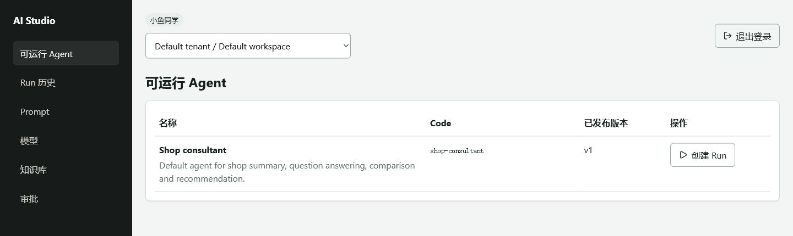
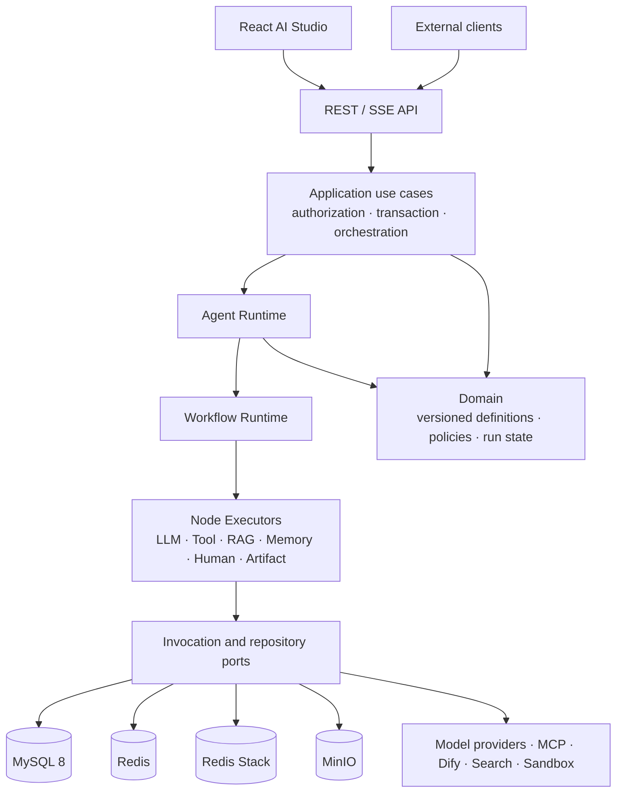
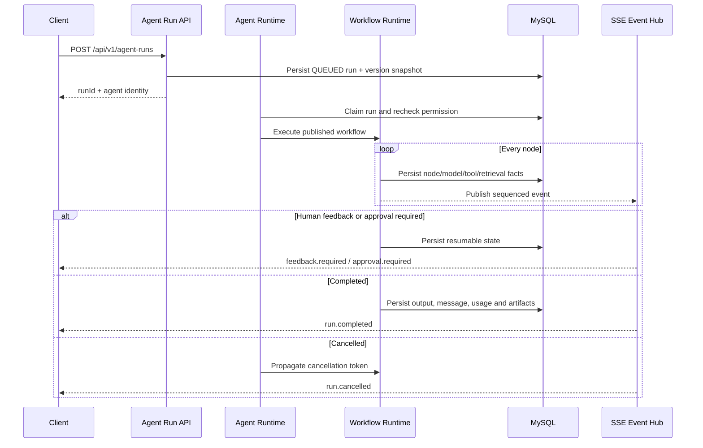
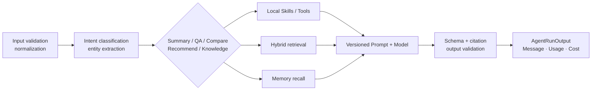

<p align="center">
  
</p>

<h1 align="center">AI Dianping</h1>

<p align="center">
  <strong>面向本地生活场景的多租户 Agent 平台</strong><br />
  从版本化定义、工作流编排和知识检索，到安全执行、记忆、评测与完整调用观测。
</p>

<p align="center">
  <a href="https://github.com/makabaka165/tianchi_LOREAL_comp1/actions/workflows/unit.yml"></a>
  <a href="https://github.com/makabaka165/tianchi_LOREAL_comp1/actions/workflows/integration.yml"></a>
  <a href="https://github.com/makabaka165/tianchi_LOREAL_comp1/actions/workflows/security.yml"></a>
  <a href="https://github.com/makabaka165/tianchi_LOREAL_comp1/actions/workflows/api-contract.yml"></a>
</p>

<p align="center">
  
  
  
  
</p>

<p align="center">
  <a href="#核心能力">核心能力</a> ·
  <a href="#系统架构">系统架构</a> ·
  <a href="#快速开始">快速开始</a> ·
  <a href="#api-调用示例">API 示例</a> ·
  <a href="#验证与质量门禁">验证</a> ·
  <a href="#文档导航">文档</a>
</p>

---

<p align="center">
  
</p>

<p align="center"><sub>真实本地环境中的 AI Studio：租户与工作空间隔离、已发布 Agent 发现和 Run 创建入口。</sub></p>

## 项目简介

AI Dianping 是一个基于 Java 11 和 Spring Boot 2.7 的模块化单体。项目保留店铺、探店内容、关注、签到和优惠券秒杀等本地生活业务，同时在 `com.hmdp.ai` 内构建了一套持久化、租户隔离的 Agent Platform。

它不是把一次模型调用包装成聊天接口。一次 Agent Run 会绑定确定的 Agent、Workflow、Prompt、Model 和 Knowledge 版本，并在执行期间记录节点、模型、工具、检索、制品、用量与成本事实。工作流可以暂停、恢复、取消和重试，已发布资源保持不可变，外部能力通过受控端口接入。

## 核心能力

| 能力 | 当前实现 |
| --- | --- |
| 通用 Agent Runtime | 任意已发布 Agent 都可绑定精确版本快照执行，不依赖店铺兼容服务 |
| 版本化资源 | Agent、Model Profile、Prompt、Workflow、Tool、Knowledge Base 使用 DRAFT/PUBLISHED 生命周期；已发布版本只读 |
| 工作流编排 | 支持分支、并行、Join、ForEach、Loop、人机反馈、审批、LLM、Tool、RAG、Memory、文档解析、数据转换和 Artifact 节点 |
| 模型与 Prompt | 按 Model Profile Version 动态创建 OpenAI-compatible 客户端；变量渲染、能力校验、Token Budget、重试、限流与熔断进入统一链路 |
| Tool 与外部集成 | Local Skill、HTTP Tool、MCP、Dify、External Search 和 Docker Sandbox；高风险调用绑定独立审批与输入哈希 |
| 企业知识与 RAG | MySQL 文档事实、MinIO 原文件、Redis Stack 向量/全文混合检索、结构化 PII 脱敏、Shadow Index 与 Outbox 恢复 |
| 记忆与评测 | 会话、工作、情节和事实记忆召回；评测 Worker 自动运行 Agent/Workflow/Prompt/RAG/Tool 目标并保存指标 |
| 运行观测 | `runId + nodeRunId + invocationId + traceId` 贯穿 Model、Tool、Retrieval、MCP、Dify、Search 与 Sandbox |
| 安全边界 | 默认拒绝权限模型、运行前重新鉴权、SSRF 防护、路径穿越防护、Artifact 所有权校验、Secret 引用和敏感信息脱敏 |
| AI Studio | React 前端已完成登录、Session Bootstrap、Workspace 切换、可运行 Agent、Run 创建/历史/详情与 SSE 观察闭环 |

## 系统架构

MySQL 是业务与 Agent 运行事实的唯一真源；Redis 用于缓存、协调和工作记忆；Redis Stack 保存可重建的检索索引；MinIO 保存原始文档与生成制品。



模块依赖方向由 ArchUnit 约束：Controller 不直接调用模型，Application 负责用例与权限，Runtime 只面向领域端口，生产适配器位于 Infrastructure。

### 一次 Agent Run 如何闭环



### 默认 shop-consultant 工作流

默认 Agent 使用原生 Runtime。Tool、知识检索和记忆结果会作为不可信数据分区进入版本化 Prompt，再由通用模型网关执行。



## 技术栈

| 层级 | 技术 |
| --- | --- |
| Backend | Java 11, Spring Boot 2.7, Spring MVC, MyBatis-Plus, Flyway |
| AI Runtime | LangChain4j, OpenAI-compatible API, Resilience4j, JSON Schema |
| Data | MySQL 8, Redis 7, Redis Stack, Redisson, MinIO |
| Document | Apache Tika, PDFBox, Apache POI |
| Frontend | React 19, TypeScript 6, Vite 8, TanStack Query, Zustand, Zod |
| Test & Quality | JUnit 5, ArchUnit, Testcontainers, Vitest, Playwright, Spotless |
| Delivery | Docker Compose, Maven Surefire/Failsafe, GitHub Actions, OpenAPI |

## 仓库结构

```text
AI_dianping/
├── src/main/java/com/hmdp/ai/
│   ├── api/                 # REST/SSE 协议、DTO 与显式权限
│   ├── application/         # 用例、事务、授权与任务编排
│   ├── domain/              # 版本化定义、状态机、策略与端口
│   ├── runtime/             # Agent/Workflow Runtime 与节点执行器
│   ├── infrastructure/      # JDBC、Redis、MinIO、模型和外部系统适配器
│   └── legacy/              # 仅供旧 Shop AI API 使用的兼容边界
├── src/main/resources/db/   # 基线 SQL 与 Flyway 迁移
├── frontend/                # React AI Studio
├── docs/
│   ├── architecture/        # Runtime、RAG、Memory、安全与观测设计
│   ├── api/openapi.yaml     # 公开 API 合同
│   ├── adr/                 # 关键架构决策
│   └── examples/            # 可执行 HTTP 示例
├── scripts/                 # 基础设施、迁移与端到端验收脚本
└── .github/workflows/       # Unit、Integration、Security、API Contract
```

## 快速开始

### 环境要求

- JDK 11+
- Maven 3.8+
- Node.js 20+
- Docker Desktop 或 Docker Engine + Compose v2
- Python 3.8+（运行完整验收脚本时需要）

### 1. 获取当前开发分支

```bash
git clone https://github.com/makabaka165/tianchi_LOREAL_comp1.git
cd tianchi_LOREAL_comp1
```

### 2. 启动基础设施与后端

```bash
docker compose -f docker-compose.ai.yml up -d --wait
```

> Oracle MySQL 8 首次初始化需要处理两条历史迁移的兼容桥接。请在第一次启动后端前阅读[本地开发与 MySQL 8 初始化](docs/operations/local-development.md)，不要修改已经发布的 Flyway 文件。

数据库初始化顺序固定为两步：先导入 `src/main/resources/db/hmdp.sql` 建立基础业务表，随后启动应用时 Flyway 会自动执行 `src/main/resources/db/migration` 下的全部增量迁移。不要只导入 `hmdp.sql` 后关闭 Flyway，否则 AI 平台与后续客服领域表会缺失。

在 Oracle MySQL 8 上，如两条历史迁移出现 checksum 校验失败，请使用 `scripts/repair-mysql8-flyway-compatibility.ps1` 完成兼容桥接；脚本会将 `20260720.03` 与 `20260721.01` 的成功校验和对齐为 `2143241596` 与 `814957484`，不会修改任何已发布迁移文件。

```bash
export DB_PASSWORD=change_me_local
export MINIO_ACCESS_KEY=local_minio_user
export MINIO_SECRET_KEY=change_me_local_minio
export HMDP_SMS_MOCK_ENABLED=true
export REDIS_PORT=6381
export MEMORY_REDIS_PORT=6381
export VECTOR_REDIS_PORT=6380

mvn spring-boot:run -Dspring-boot.run.profiles=local
```

> 本地基础设施端口全部只绑定 `127.0.0.1`：MySQL `3307`、业务/记忆 Redis `6381`（`REDIS_PORT=6381`、`MEMORY_REDIS_PORT=6381`）、向量 Redis Stack `6380`（`VECTOR_REDIS_PORT=6380`）、MinIO `9000/9001`。修改端口时保持 `.env`、`docker-compose.ai.yml` 与应用配置一致。

### 3. 启动 AI Studio

```bash
cd frontend
npm ci
npm run dev -- --host 127.0.0.1 --port 5173
```

访问地址：

- AI Studio: `http://127.0.0.1:5173`
- Backend: `http://127.0.0.1:8081`
- Health: `http://127.0.0.1:8081/actuator/health`
- MinIO Console: `http://127.0.0.1:9001`

模型调用需要已发布的 Model Profile Version。`secretRef` 只保存 `env:VARIABLE_NAME` 形式的引用，真实密钥通过运行环境提供。

## API 调用示例

所有 `/api/v1/**` 请求使用 Bearer Token，并显式携带租户与工作空间。

```bash
curl -X POST "http://127.0.0.1:8081/api/v1/agent-runs" \
  -H "Authorization: Bearer $TOKEN" \
  -H "X-Tenant-Id: $TENANT_ID" \
  -H "X-Workspace-Id: $WORKSPACE_ID" \
  -H "Content-Type: application/json" \
  -d '{
    "agentId": "shop-consultant",
    "agentVersion": 1,
    "sessionId": "demo-session",
    "input": {
      "text": "对比 1 号店和 2 号店的服务态度",
      "parts": [],
      "attachments": [],
      "referenceUris": []
    },
    "responseMode": "STREAM",
    "metadata": {"channel": "readme"}
  }'
```

创建响应始终同时返回内部定义 ID 与稳定 Agent Code：

```json
{
  "runId": "...",
  "status": "QUEUED",
  "agentDefinitionId": "agent-shop-consultant",
  "agentCode": "shop-consultant",
  "agentVersion": 1
}
```

使用 `Last-Event-ID` 可以无缝恢复 SSE：

```bash
curl -N "http://127.0.0.1:8081/api/v1/agent-runs/$RUN_ID/events" \
  -H "Authorization: Bearer $TOKEN" \
  -H "X-Tenant-Id: $TENANT_ID" \
  -H "X-Workspace-Id: $WORKSPACE_ID" \
  -H "Last-Event-ID: 0"
```

更多请求见 [`docs/examples/`](docs/examples/)；完整合同见 [`docs/api/openapi.yaml`](docs/api/openapi.yaml)。

## 验证与质量门禁

| 层级 | 命令 | 覆盖范围 |
| --- | --- | --- |
| Backend verify | `mvn clean verify` | 编译、单元测试、架构测试、静态合同与 Spotless |
| Full integration | `mvn clean verify -Pfull-integration` | Testcontainers、MySQL、Redis/Redis Stack、MinIO 与 Runtime 集成测试 |
| Platform E2E | `./scripts/verify-ai-platform.sh` | Flyway、健康检查、默认 Agent、Run、SSE、知识入库/检索/删除和 Artifact 权限 |
| Frontend | `npm run lint && npm run typecheck && npm run test && npm run build` | 静态检查、类型、组件/传输层测试与生产构建 |
| Browser E2E | `PLAYWRIGHT_REAL_BACKEND=true npm run test:e2e` | 登录、Session、Agent 列表、Run 创建、SSE 与历史持久化 |

GitHub Actions 将构建、完整集成、安全扫描和 OpenAPI 合同拆成独立工作流。默认测试使用 Fake/OpenAI-compatible 验证 Provider，不会调用外部付费模型。

## 安全与一致性原则

- 所有 `/api/v1/**` Handler 显式声明权限；缺少权限声明不会回落到默认能力。
- Run 领取、恢复和 Tool/MCP/Dify/Sandbox 执行前重新读取当前权限，权限快照只用于审计。
- HIGH/CRITICAL Tool 需要独立审批人、`TOOL_APPROVE` 权限、有效期和输入哈希一致。
- 已发布版本不可原地修改；历史 Run 依靠版本快照恢复精确配置。
- Knowledge Index 通过 Outbox 构建 Shadow Index，验证成功后才原子切换 Active Index。
- Prompt、Tool Result、Retrieval 和 Memory 分区注入；日志与持久化摘要执行 Secret/PII 脱敏。
- HTTP、MCP 和搜索调用执行 DNS 重绑定、私网地址、重定向和响应预算检查。
- Sandbox 使用只读文件系统、非 root 用户、能力移除、无网络和资源上限。

## 当前开发状态

| 范围 | 状态 |
| --- | --- |
| Agent Platform 后端 | 通用 Runtime、原生 Workflow、RAG、Memory、Evaluation、Approval 与 Observability 已进入自动化验证链路 |
| AI Studio | 首条 Agent 垂直链路可用；Prompt、Model、Knowledge 等完整管理页面仍在迭代 |
| 外部 Provider | OpenAI-compatible、MCP、Dify、Search 与 Sandbox 适配器已接入；生产密钥和允许列表由部署环境配置 |
| Legacy Shop AI | 保留兼容入口并返回弃用语义；新客户端应使用 `/api/v1/agent-runs` |

## 文档导航

| 主题 | 文档 |
| --- | --- |
| 客服共情副驾 | [上下文地图](CONTEXT-MAP.md) · [目标架构](docs/architecture/beauty-service-copilot.md) · [连续执行实施计划](docs/implementation/beauty-service-copilot-execution-plan.md) · [输出契约](docs/contracts/customer-service-assistance-output.schema.json) |
| 平台总览 | [Agent Platform Overview](docs/architecture/agent-platform-overview.md) |
| Agent 与 Workflow Runtime | [Agent Runtime](docs/architecture/agent-runtime.md) · [Workflow Runtime](docs/architecture/workflow-runtime.md) |
| 知识入库与检索 | [Knowledge Ingestion](docs/architecture/knowledge-ingestion.md) · [Hybrid Retrieval](docs/architecture/hybrid-retrieval.md) |
| Tool 与外部系统 | [Tool, MCP and Dify](docs/architecture/tool-mcp-dify.md) |
| Memory 与 Observability | [Memory System](docs/architecture/memory-system.md) · [Observability](docs/architecture/observability.md) |
| 安全模型 | [Security Model](docs/architecture/security-model.md) |
| 本地运行 | [Local Development](docs/operations/local-development.md) |
| API 与迁移 | [OpenAPI](docs/api/openapi.yaml) · [Legacy API Migration](docs/migration/legacy-ai-api.md) |
| 架构决策 | [ADR Index](docs/adr/) |

---

项目当前以 `main` 为开发分支。README 中的能力描述以仓库内生产代码、自动化测试和可执行验收脚本为准。
