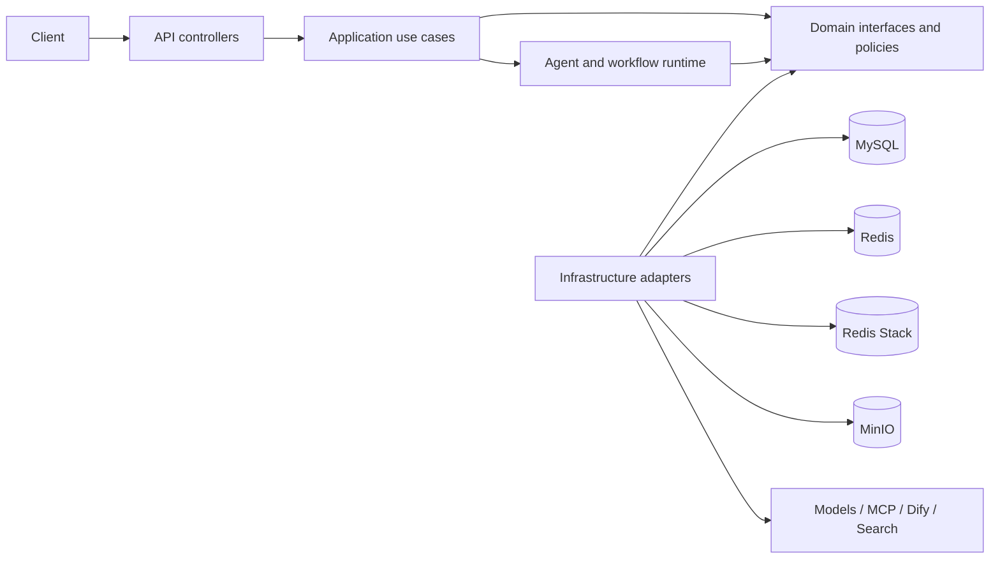
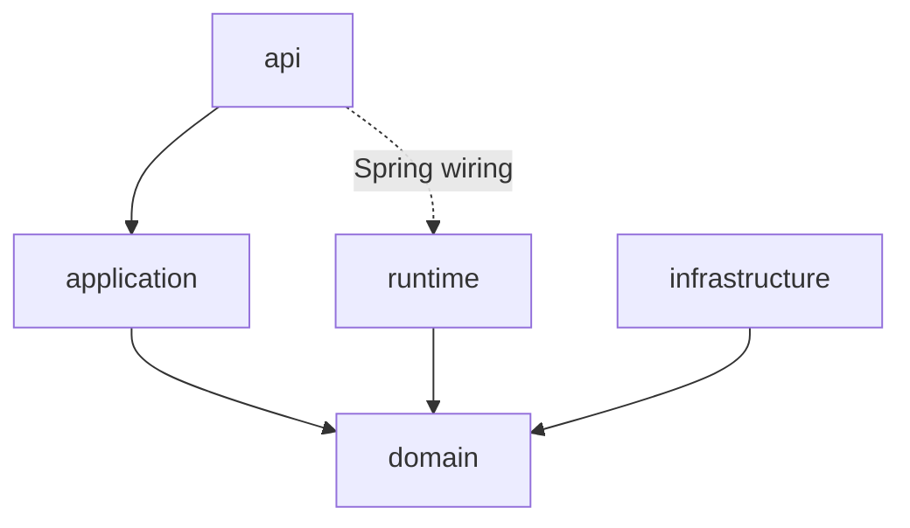

# Agent Platform Overview

The AI platform is a modular monolith inside `com.hmdp.ai`. MySQL is the source of truth; Redis is used for coordination and working-memory acceleration; Redis Stack serves lexical/vector indexes; MinIO stores source files and artifacts.

## Module dependencies

The principal seams are repositories and ports in `domain`. Production adapters live in `infrastructure`; test fakes remain in test source. ArchUnit rejects top-level package cycles.

## Package map

- `api`: REST/SSE protocol conversion and validation.
- `application`: authorization, transactions and use-case orchestration.
- `domain`: versioned definitions, run state, security, knowledge, memory, feedback and evaluation contracts.
- `runtime`: Agent execution, workflows, node executors, tool pipeline, retrieval and memory observers.
- `infrastructure`: JDBC, Redis, Redis Stack, MinIO, parsers, model providers, MCP, Dify, HTTP and sandbox adapters.
- `shared`: JSON schema, IDs, hashing and validation.

## Persistence

Flyway migrations `V20260718_01` through `V20260718_06` create tenant/security, model/prompt/agent/run, workflow/tool, knowledge, memory/evaluation/observability and MCP tables. Versioned records are immutable after publication. Runs store version snapshots rather than only mutable IDs.

| Table group | Purpose |
| --- | --- |
| `ai_tenant`, `ai_workspace`, members, ACL | identity scope and resource authorization |
| `ai_model_profile`, `ai_prompt*`, `ai_agent*` | model references and immutable Agent/Prompt versions |
| `ai_workflow*`, `ai_tool*`, `ai_mcp*` | orchestration and external execution definitions |
| `ai_knowledge_base*`, `ai_document*`, `ai_ingestion_job`, `ai_index_version` | persistent knowledge and index publication |
| `ai_run`, `ai_node_run`, call/retrieval/artifact tables | execution facts, audit and cost evidence |
| conversation/message/memory tables | short-term, working, episodic and long-term memory |
| feedback/evaluation/audit tables | quality loop, regression evaluation and administration |

## Local operation

Start dependencies with `./scripts/start-ai-infra.sh`, export the variables from `.env.example`, then run `mvn spring-boot:run -Dspring-boot.run.profiles=local`. Use `./scripts/verify-ai-platform.sh` for dependency and compilation checks.

## Troubleshooting

- MySQL connection failure: verify `DB_URL`, `DB_USERNAME`, `DB_PASSWORD` and container health.
- Empty vector results: verify the published knowledge/index version and Redis Stack on port 6380.
- `PROVIDER_NOT_CONFIGURED`: configure the referenced environment secret; the platform never fabricates provider output.
- MCP/Dify/HTTP rejection: verify the allow-listed host, DNS result and private-network policy.
- Sandbox failure: verify Docker is available and the configured image/command is allow-listed.
