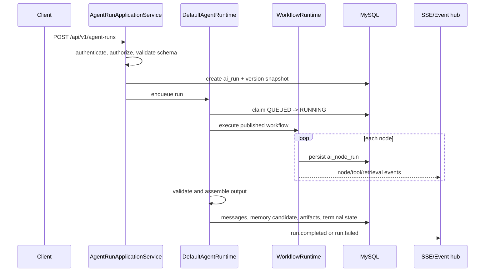

# Agent Runtime

`DefaultAgentRuntime` executes an explicitly published Agent version and persists every transition.

`ExecutionContext` is immutable and carries tenant, workspace, user, session, run, Agent version, authorization, deadline, budget and trace data. Controllers never call models or construct prompts.

Run status supports created, queued, running, waiting for user/approval, completed, failed, cancelled and timed out. Retry creates a related run; cancellation and resume are conditional database updates. Hidden model reasoning is neither persisted nor exposed: only route/tool/node decisions, evidence IDs and short summaries are stored.
