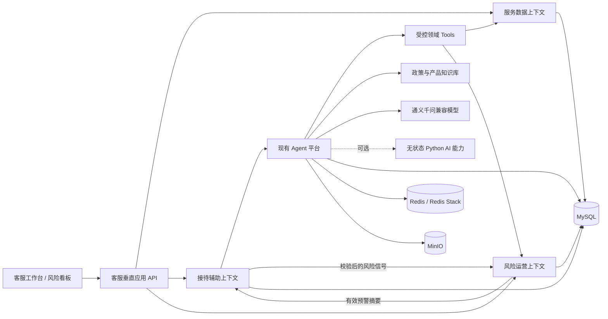
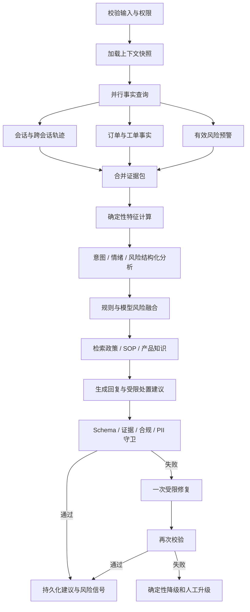

# 美妆客服共情副驾目标架构

Status: Proposed for the competition vertical slice

本文把赛题材料映射为现有 Java Agent 平台上的可实施边界。统一语言以根目录 [CONTEXT-MAP.md](../../CONTEXT-MAP.md) 为准，关键取舍记录在 ADR 0005、0006 和 0007。

## 1. 目标与非目标

### 目标

1. 在客服工作台右侧提供消费者服务轨迹、当前意图、情绪趋势、风险提示、回复草稿和受限处置建议。
2. 对不良反应、情绪升级、重复进线、退款异常、物流异常、错漏发和承诺纠纷形成可分派、可跟踪、可关闭的风险预警。
3. 每条事实、风险信号和服务建议都能回到消息、订单快照、服务工单或已发布知识片段。
4. 利用现有 Agent Runtime、Workflow、Tool、RAG、评测、SSE、版本快照和审计能力，不重写平台内核。
5. 形成可量化的离线评测和演示链路，而不是只展示一次模型回答。

### 非目标

- 不在比赛阶段升级 Java、Spring Boot 或 LangChain4j 主版本。
- 不让模型自动退款、打款、修改订单、关闭工单或发送未经客服确认的消息。
- 不把所有结构化数据向量化，也不以 RAG 替代关系查询。
- 不在第一阶段拆分微服务或清理全部本地生活遗留模块。
- 不使用赛题中的场景标签作为线上 Agent 输入。

## 2. 已知约束

赛题数据包含 998 条消息、138 个服务会话、112 个消费者别名、113 个订单快照和 80 张服务工单。24 个消费者别名出现在多个会话中，因此重复进线和跨会话轨迹具备可演示样本。

数据同时存在以下限制：

- 表格声明一个会话至多关联一笔订单和一张工单，但真实系统不能固化这个人工数据约束，领域关系按一对多设计。
- `买家昵称` 是脱敏别名，不是可靠的全局消费者 ID；归并结果必须保留来源范围和置信度。
- `scene_major`、`scene_minor` 和目标消息标记属于评测标签，运行时上下文必须排除这些字段，避免标签泄漏。
- 表格引用 29 个图片路径，但材料中没有对应图片文件。第一阶段只展示缺失证据状态；补充 MOCK 图片必须记录来源和生成方式。
- 当前 Agent 输入能够声明 IMAGE，但通用 LLM 节点仍以字符串 Prompt 调用模型，不能宣称已完成原生视觉链路。

## 3. 系统结构



### 上下文所有权

| 上下文 | 拥有的状态 | 不拥有的状态 | 建议表前缀 |
| --- | --- | --- | --- |
| 服务数据 | 导入批次、消费者别名、会话、消息、订单快照、服务工单、来源链接 | 模型结论、回复建议、风险生命周期 | `cs_data_` |
| 接待辅助 | 上下文快照、辅助请求、Agent Run 关联、建议、采纳决定 | 来源业务事实、模型运行内部状态、风险状态 | `cs_assist_` |
| 风险运营 | 风险信号、风险预警、负责人、SLA、处置记录 | 服务工单状态、订单状态、回复草稿 | `cs_risk_` |
| Agent 平台 | Agent、Workflow、Prompt、Model、Tool、Knowledge、Run、Evaluation | 消费者、订单、工单、风险预警 | 现有 `ai_` |

所有上下文部署在一个 Spring Boot 进程并使用一个 MySQL 实例，但 Repository 和写事务不得跨越表所有权。跨上下文协调由应用服务、领域事件和稳定 ID 完成。

## 4. 核心聚合与不变量

### 4.1 服务会话

服务会话聚合拥有消息顺序和来源幂等性。

- `message_id + source_system` 唯一，重复导入不产生新消息。
- 同一会话按来源消息序号排序；来源时间仅用于展示和跨对象时间线。
- 订单号、工单号和物流号按字符串保存，禁止数值化导致精度或前导零丢失。
- 导入事实采用追加或版本化更新，不用模型结果覆盖来源字段。

### 4.2 辅助建议

辅助建议聚合连接一个上下文快照和一个 Agent Run。

- 上下文快照以事实版本和内容哈希标识，创建后不可变。
- 新消息、订单状态或工单状态发生变化后，旧建议标记为 `STALE`，不能直接插入发送区。
- 一个建议只有一个最终采纳决定：`ACCEPTED`、`ACCEPTED_WITH_EDIT`、`REJECTED` 或 `EXPIRED`。
- 编辑后发送时保留原草稿、最终文本和差异摘要，用于评测，不覆盖模型输出。
- 所有事实字段和风险理由至少引用一个当前快照中的证据 ID。

### 4.3 风险预警

风险预警是闭环聚合，风险信号只是它的输入。

- 同一归并键在有效窗口内最多有一个未终结预警。
- 规则确定的最低等级不能被模型输出降低。
- 状态主路径为 `OPEN -> ACKNOWLEDGED -> IN_PROGRESS -> RESOLVED`。
- `OPEN` 或 `ACKNOWLEDGED` 可以转为 `DISMISSED`，但必须记录理由。
- 已解决或已驳回预警不重新打开；新风险创建关联预警，以保留历史闭环结论。
- 每次定级、分派、升级、解决和驳回都产生不可覆盖的处置记录。

## 5. 数据导入与存储

### 5.1 导入流程

```text
上传 XLSX
  -> 文件哈希与格式校验
  -> 逐 Sheet 解析到暂存记录
  -> 字段、时间、主键和关联关系校验
  -> 生成导入预览和错误报告
  -> 人工确认
  -> 幂等写入服务数据表
  -> 发布 ServiceFactsImported
  -> 可选触发离线风险扫描与评测样本构建
```

Apache POI 已在当前项目中，可直接实现导入，不需要为了读取比赛数据增加 Python 运行依赖。

### 5.2 Sheet 映射

| Sheet | 领域对象 | 关键说明 |
| --- | --- | --- |
| 聊天记录 | 服务会话、服务消息、来源链接 | 运行表排除 `scene_major`、`scene_minor` 和目标消息标签 |
| 订单 | 订单快照 | 每次导入保留来源状态和导入批次，不提供交易写操作 |
| 补发换货工单 | 服务工单 `REPLACEMENT` | 类型特有字段进入受版本约束的明细载荷 |
| 线下打款工单 | 服务工单 `OFFLINE_PAYMENT` | 账号字段继续脱敏，禁止进入模型日志 |
| 物流工单 | 服务工单 `LOGISTICS` | 物流号为来源引用，不调用真实物流接口 |
| 不良反应工单 | 服务工单 `ADVERSE_REACTION` | 消费者自述不得转换为医学诊断 |
| 售后退货工单 | 服务工单 `RETURN` | 来源异常标记可以形成风险信号，但不是最终责任判断 |

### 5.3 建议逻辑表

```text
cs_data_import_batch
cs_data_consumer
cs_data_consumer_alias
cs_data_conversation
cs_data_message
cs_data_order_snapshot
cs_data_service_case
cs_data_source_link

cs_assist_context_snapshot
cs_assist_request
cs_assist_suggestion
cs_assist_decision

cs_risk_signal
cs_risk_alert
cs_risk_alert_signal
cs_risk_disposition
```

不同工单的公共字段进入 `cs_data_service_case`，类型特有字段保存在带 schema 版本的明细 JSON。业务查询通过类型化 DTO 暴露，不允许调用方依赖任意 JSON 路径。

评测标签单独进入测试资源或 `ai_evaluation_*` 数据集，不与生产式 `cs_data_*` 查询端口共用。

## 6. 应用用例与接口

### 6.1 工作台读取

`GET /api/v1/customer-service/conversations/{conversationId}/workspace`

返回当前会话、消费者轨迹摘要、关联订单、服务工单、有效风险预警和最近一次仍有效的建议。它是组合查询，不暴露跨上下文实体。

### 6.2 发起辅助

`POST /api/v1/customer-service/conversations/{conversationId}/assistance-requests`

应用服务创建上下文快照和辅助请求，再通过现有 Agent Run API 启动 `beauty-service-copilot` 已发布版本。客户端使用现有 SSE 机制观察节点状态并在完成后读取结构化建议。

### 6.3 记录采纳

`POST /api/v1/customer-service/suggestions/{suggestionId}/decisions`

请求只允许 `ACCEPT`、`ACCEPT_WITH_EDIT` 或 `REJECT`。接受前重新比较上下文哈希；建议过期时返回冲突并要求重新生成。

### 6.4 风险闭环

```text
GET  /api/v1/customer-service/risk-alerts
GET  /api/v1/customer-service/risk-alerts/{alertId}
POST /api/v1/customer-service/risk-alerts/{alertId}/acknowledge
POST /api/v1/customer-service/risk-alerts/{alertId}/assign
POST /api/v1/customer-service/risk-alerts/{alertId}/start
POST /api/v1/customer-service/risk-alerts/{alertId}/resolve
POST /api/v1/customer-service/risk-alerts/{alertId}/dismiss
```

命令接口携带预期版本，使用乐观锁避免两个客服同时覆盖处置状态。

### 6.5 领域事件

| 事件 | 发布者 | 主要消费者 |
| --- | --- | --- |
| `ServiceFactsImported` | 服务数据 | 离线风险扫描、评测数据准备 |
| `ConsumerMessageReceived` | 服务数据 | 接待辅助、实时风险扫描 |
| `AssistanceProposed` | 接待辅助 | 工作台通知、质量统计 |
| `SuggestionDecided` | 接待辅助 | 采纳率评测、后续执行适配器 |
| `RiskSignalAccepted` | 风险运营 | 预警归并策略 |
| `RiskAlertOpened` | 风险运营 | 看板、SLA 通知 |
| `RiskAlertResolved` | 风险运营 | 工作台轨迹、闭环指标 |

第一阶段可以使用 Spring 事务后事件；需要跨进程投递时复用现有 Outbox 思路，不引入新的消息中间件。

## 7. Agent 工作流

`beauty-service-copilot` 使用显式工作流，不允许模型自由决定是否查询业务事实。



### 7.1 领域 Tools

| Tool Code | 所属上下文 | 行为 |
| --- | --- | --- |
| `get-service-conversation` | 服务数据 | 返回当前消息和稳定证据 ID |
| `get-consumer-service-journey` | 服务数据 | 返回历史会话、重复进线和最近服务事实 |
| `get-order-snapshots` | 服务数据 | 按会话或消费者返回精确订单事实 |
| `get-service-cases` | 服务数据 | 返回关联和未关闭服务工单 |
| `get-active-risk-alerts` | 风险运营 | 返回当前有效预警摘要 |
| `retrieve-service-policy` | Agent 平台 | 检索已发布政策、SOP 和产品知识 |

这些 Tool 只读。创建预警、记录采纳和外部业务动作由应用命令完成，不作为模型可自由调用的 Tool。

### 7.2 确定性特征

模型分析前先计算可解释特征，例如：

- 最近时间窗内进线次数及未解决会话数；
- 当前订单和服务工单是否存在状态冲突；
- 工单等待时长、重复退款或重复补发次数；
- 消费者消息中的紧急表达和情绪词变化；
- 是否涉及不良反应、就医自述、公开投诉威胁或高金额争议。

特征必须保留计算版本和证据引用。模型可以补充风险信号，但不能修改原始特征。

### 7.3 输出与守卫

机器契约见 [customer-service-assistance-output.schema.json](../contracts/customer-service-assistance-output.schema.json)。输出只包含简短判断、事实、回复草稿、建议动作、引用和警告，不保存或展示隐藏思维链。

守卫至少执行：

1. JSON Schema 校验和字段长度预算；
2. 所有 evidence ref 必须存在于当前上下文快照；
3. 订单、金额、物流、工单状态等事实与来源值精确一致；
4. 禁止医学诊断、效果保证、责任认定和未经授权的赔付承诺；
5. 动作类型必须在 allow-list，参数符合动作 schema；
6. PII 和 Secret 脱敏；
7. 高风险确定性规则触发时必须 `needHumanEscalation=true`。

## 8. 初始风险策略

以下是演示版策略下限，最终阈值需要用标注集校准。

| 风险类型 | 典型证据 | 初始等级下限 | 建议路由 |
| --- | --- | --- | --- |
| `ADVERSE_REACTION` | 泛红、刺痒、爆痘、不适工单 | `HIGH`；出现就医或严重自述时 `CRITICAL` | 专业售后人工接管 |
| `EMOTION_ESCALATION` | 连续负向表达、催促升级、公开投诉威胁 | `MEDIUM` | 优先接待并复核历史承诺 |
| `REPEAT_CONTACT` | 同一问题多次进线且存在未解决工单 | `MEDIUM` | 展示完整轨迹并指定负责人 |
| `REFUND_ANOMALY` | 少退、重复退款、线下打款长期未完成 | `HIGH` | 财务或售后专员复核 |
| `LOGISTICS_EXCEPTION` | 停滞、丢件、签收未收到、破损 | `MEDIUM` | 物流工单或仓库核实 |
| `MISSING_OR_WRONG_ITEM` | 少件、漏发赠品、错发色号 | `MEDIUM` | 检查既有补发工单，避免重复承诺 |
| `PROMISE_DISPUTE` | 直播承诺、赠品或价保争议 | `MEDIUM` | 检索活动政策并人工确认口径 |
| `PUBLIC_OPINION_RISK` | 明确公开曝光或监管投诉表达 | `HIGH` | 风险负责人接管 |

风险融合采用等级下限：最终等级不得低于确定性策略等级。低置信模型信号可以进入待确认队列，但不能独立触发不可逆业务动作。

## 9. Java 与 Python 边界

| 能力 | 默认归属 | 原因 |
| --- | --- | --- |
| XLSX 导入、领域表、风险生命周期 | Java | 与事务、权限、审计和既有 MySQL 一致 |
| Agent/Workflow/Tool/RAG/Run/SSE | Java | 已实现并通过现有验证门禁 |
| Prompt 实验、数据分析、离线评测 | Python `experiments/` | 迭代快，适合 pandas/polars 与评测生态 |
| 原生视觉、本地 Transformer、OCR | 可选 Python capability service | 仅在 Java 模型适配器不具备所需能力时部署 |
| 业务写操作和闭环状态 | 禁止 Python 拥有 | 避免双写、越权和不可审计状态 |

可选 Python 服务必须满足：

- 无状态、无业务数据库凭据，不缓存原始 PII；
- 只接受最小化文本或短期签名对象 URI；
- 每个接口有版本化 JSON Schema、8 秒级超时、大小上限和并发限制；
- 返回观察结果和证据，不返回业务命令；
- Java 侧继续执行权限、重试、熔断、审计、结果限制和领域校验；
- 服务不可用时工作流降级为文本与结构化事实链路，不阻塞客服工作台。

不允许出现 Java 调 Python 编排、Python 再反向调用 Java Agent Run 的环形控制流。

## 10. 建议代码结构

继续采用单 Maven 模块，通过顶层包和 ArchUnit 保证边界：

```text
src/main/java/com/hmdp/
├── ai/                         # 现有通用 Agent 平台，禁止反向依赖客服包
├── servicedata/
│   ├── api/
│   ├── application/
│   ├── domain/
│   └── infrastructure/
├── serviceassist/
│   ├── api/
│   ├── application/
│   ├── domain/
│   └── infrastructure/
└── riskops/
    ├── api/
    ├── application/
    ├── domain/
    └── infrastructure/

frontend/src/modules/
├── service-workbench/
├── risk-alerts/
└── service-data-import/

experiments/
├── dataset/
├── prompts/
├── evaluation/
└── README.md
```

不创建通用 `customer-common` 领域包。跨上下文 ID 和 DTO 放在提供方的公开 application contract 中，消费方自行映射为本地概念。

建议新增 ArchUnit 规则：

- `ai..` 不依赖 `servicedata..`、`serviceassist..`、`riskops..`；
- `servicedata..` 不依赖另外三个上下文；
- `riskops..domain..` 不依赖 Agent 平台和基础设施；
- API 不直接访问 Repository 或模型；
- 跨上下文不得引用 `entity`、`mapper` 或 `infrastructure` 包。

## 11. 前端边界

客服第一屏沿用赛题说明的三栏工作台：

- 左侧：待接待列表、风险等级、等待时间和重复进线标记；
- 中部：实时会话、当前商品或订单摘要、回复输入区；
- 右侧：服务轨迹、意图与情绪、风险、回复草稿、证据和处置建议；
- 独立风险页面：按等级、状态、类型、负责人筛选，支持查看证据时间线和闭环记录。

Agent Studio 保留为管理和调试界面，不作为比赛主演示入口。Prompt、模型和知识管理页面未完成不阻塞工作台垂直链路。

## 12. 部署轮廓

比赛 profile 以可重复演示为目标：

```text
Required: Spring Boot + MySQL + Redis + Qwen OpenAI-compatible endpoint
Conditional: Redis Stack for policy/product RAG
Conditional: MinIO for uploaded policy documents and actual images
Optional: Python capability service for native vision/OCR/local models
```

不要通过删除既有基础设施代码来简化比赛 profile，使用条件配置关闭未使用适配器。最终提供一个启动命令、健康检查、固定演示账号和离线 fallback 数据。

## 13. 评测与观测

### 数据隔离

- 训练、few-shot 和测试按消费者划分，不能按消息随机切分。
- 同一消费者别名的多个会话必须进入同一分区。
- 场景标签只进入评测 runner，不进入 Agent 运行上下文。
- 补充样本与官方 MOCK 数据分别标记 provenance。

### 核心指标

| 维度 | 指标 |
| --- | --- |
| 意图 | 大类和细类 Macro-F1、低置信拒答率 |
| 风险 | 高风险 Recall、Precision、误报率、预警归并准确率 |
| 事实 | 订单/工单字段精确一致率、无证据事实率、引用有效率 |
| 回复 | 客服采纳率、编辑后采纳率、禁用表达触发率、人工评分 |
| 闭环 | 首次确认时间、解决时间、超 SLA 数、重复预警率 |
| 性能 | 首建议延迟 P50/P95、Token、模型成本、降级率 |

至少比较三组基线：仅聊天上下文、聊天加结构化事实、完整工作流加风险策略和守卫。这样可以证明多源融合与 Agent 工作流分别带来的增益。

## 14. 分阶段实施

本节定义阶段目标；任务依赖、精确文件、Flyway 顺序、验证命令、验收和回滚以[连续执行实施计划](../implementation/beauty-service-copilot-execution-plan.md)为准。

### Phase 0：边界与契约

- 固定上下文地图、输出 Schema、风险类型和首条演示会话。
- 增加 competition profile，不升级基础技术栈。
- 建立 ArchUnit 边界测试骨架。

退出条件：文档、Schema、包依赖规则和演示验收脚本获得一致命名。

### Phase 1：服务数据

- 实现 XLSX dry-run、错误报告和幂等导入。
- 实现服务会话工作台组合查询。
- 隔离评测标签，验证来源引用完整性。

退出条件：138 个会话、113 个订单和 80 个工单可重现导入，重复导入不新增记录。

### Phase 2：单条纵向链路

- 以 `S00082` 不良反应场景实现完整上下文快照、Agent Run、结构化输出、守卫和采纳记录。
- 工作台展示证据、回复草稿和人工升级。
- 风险运营创建并关闭一条可审计预警。

退出条件：从选择会话到预警闭环可在同一演示中完成，模型不可用时有明确降级。

### Phase 3：风险看板与评测

- 扩展重复进线、退款、物流、错漏发和承诺纠纷。
- 实现预警归并、SLA、负责人和筛选看板。
- 运行消费者级数据切分和三组基线对比。

退出条件：核心指标、失败样本和成本数据可以直接进入答辩 PPT。

### Phase 4：受控多模态

- 补充有 provenance 的 MOCK 图片或获得真实赛题附件。
- 在 Java 原生视觉适配和 Python capability service 之间做一次小型技术验证。
- 只有在端到端评测有增益时才进入主演示链路。

退出条件：图片真实传入视觉模型、输出引用图片证据，并有文本链路 fallback。

## 15. 待确认但不阻塞 Phase 1 的问题

1. 生产式消费者主键来自何处；当前比赛数据暂以 `source + 脱敏别名` 形成受限身份映射。
2. 风险等级对应的 SLA 和负责人角色；初始值作为可配置策略，不写死在模型 Prompt。
3. 可用于 RAG 的官方政策、活动规则和产品资料范围；缺失时先使用明确标注的公开或补充 MOCK 文档。
4. 是否必须展示视觉能力；在没有实际图片证据前不把它作为核心卖点。
5. 比赛部署环境是否允许 Docker 和外网模型调用；需要准备本地固定响应的演示降级路径。
