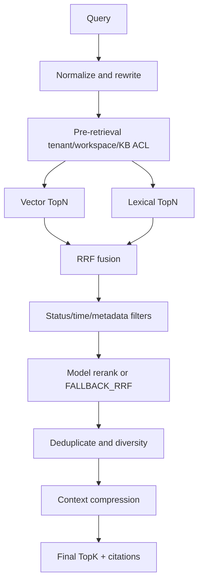

# Hybrid Retrieval

Redis Stack documents contain tenant, workspace, knowledge base/version, document/version, chunk, status, normalized search text, embedding, quality, time windows and metadata. ACL is applied before either recall path.

Document quality and semantic relevance remain separate signals. RRF never pretends to be model reranking; calls record `rerankMode=FALLBACK_RRF` when no rerank profile is configured.

Every result exposes chunk/document/version, page or sheet/row location, vector/lexical/rerank scores, compressed text, metadata and a Citation. If no trusted evidence exists, the runtime returns `INSUFFICIENT_KNOWLEDGE_EVIDENCE` rather than presenting model prior knowledge as enterprise evidence.
