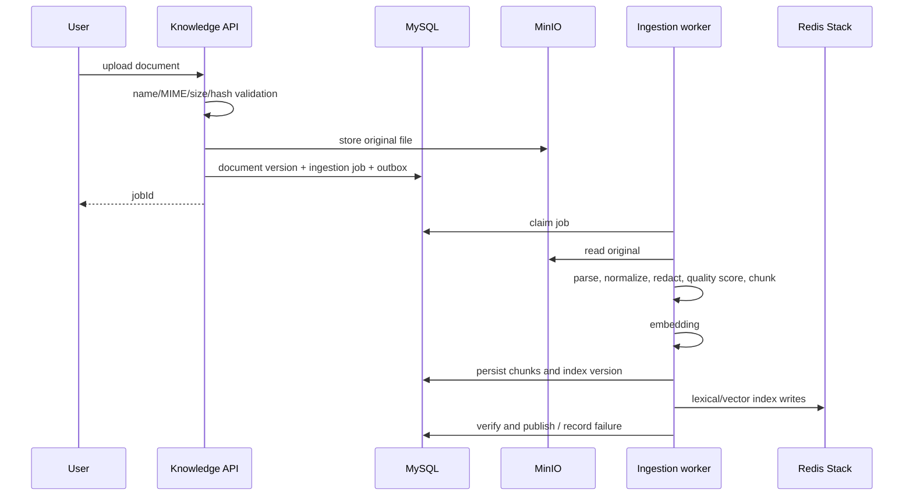

# Knowledge Ingestion

Assets are original files, Documents are logical identities, DocumentVersions are immutable parsed versions, Chunks are searchable units, and KnowledgeBaseVersion/IndexVersion are publishable snapshots.

Parsers use Tika MIME detection, PDFBox and Apache POI. Limits cover pages, spreadsheet cells, zip-bomb risk, encoding, path traversal and extension/MIME conflict. Upload is asynchronous and returns a job ID quickly.

MySQL and MinIO are durable. Index writes use outbox-driven eventual consistency. Deleting a document version removes its chunks from lexical and vector indexes. Automatic classpath import is SHA-256 idempotent and one bad file does not prevent application startup.

Chunk policies are stored per knowledge version rather than globally fixed. Implementations include recursive, heading, paragraph, QA pair, PDF structure, spreadsheet row, parent-child and semantic-boundary strategies.
