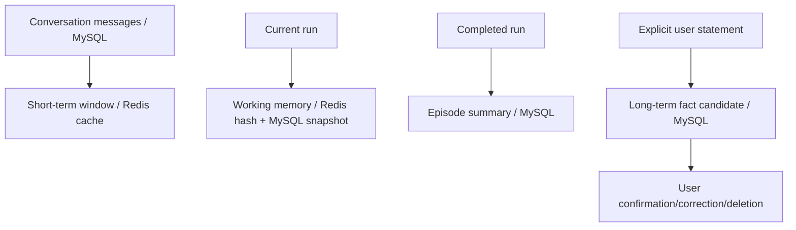

# Memory System

`MemoryKeyCodec` encodes tenant, workspace, Agent, user, session, memory type and resource without ambiguous string splitting. `MemoryPolicyService` determines TTL by `MemoryType`; legacy keys remain readable and expire naturally.

Conversation and message history is durable in MySQL. Redis only accelerates the active window and working state. Completed runs create episodes linked to source run IDs.

Long-term facts are created only from explicit “remember” statements, not model guesses. PII candidates are rejected unless policy and user confirmation permit them. APIs support list, confirm, correct, delete one, delete all and disabling long-term memory.

Anonymous principals are explicit and never share keys with authenticated users.
