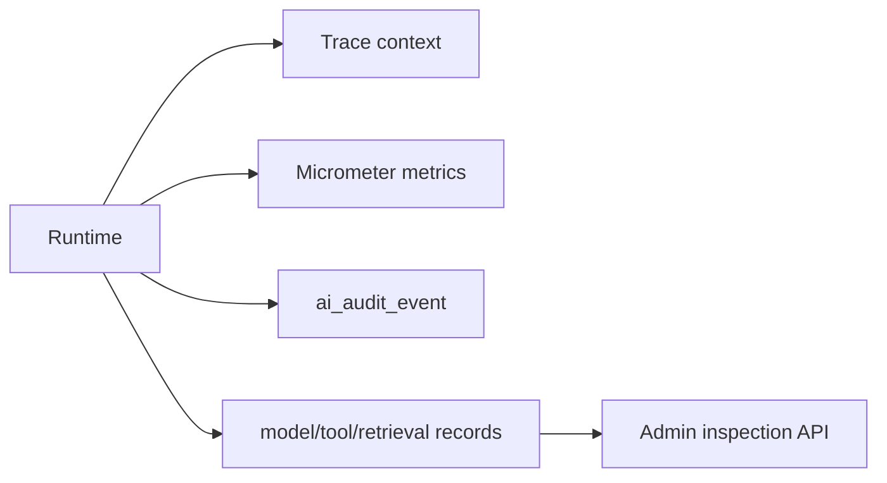

# Observability

MDC carries `traceId`, `runId`, `nodeRunId`, `tenantId`, `workspaceId` and `agentId`. Audit logs contain only identifiers, status, timing, token counts, error codes and redacted summaries.

Implemented metrics cover Agent run totals/success/failure/duration, model calls/tokens, tool calls/failures/duration, retrieval count/empty/duration, workflow nodes, feedback waiting and fallback count.

Administrator endpoints under `/api/v1/admin/runs/{runId}` expose node runs, model calls, tool calls, retrieval records, artifacts and token/cost usage. Queries are tenant/workspace scoped and require `ADMIN`.

Raw prompts, full enterprise chunks, tool secrets and hidden reasoning are not observability payloads. `AiLogSanitizer` removes bearer tokens, API keys, passwords and provider key patterns before summaries are persisted.
