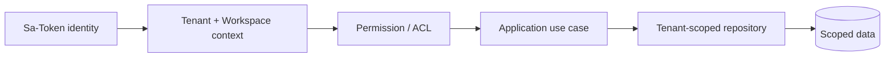

# Security Model

Each request establishes `AiSecurityContext` with user, tenant, workspace and permissions. `/api/v1/**` requires login and tenant/workspace headers. Resource repositories always include tenant/workspace predicates.

Permissions include Agent, prompt, model, workflow, tool, MCP, knowledge, memory, feedback, evaluation and admin operations. ACL roles are OWNER, ADMIN, EDITOR, RUNNER and VIEWER.

Key controls:

- retrieval ACL before recall;
- tool allow-list from the published Agent version;
- approval for high-risk tools;
- administrator-only MCP registration;
- SSRF and redirect protection for outbound HTTP;
- upload and sandbox path normalization;
- authenticated artifact downloads;
- environment-only secret resolution and no secret API response;
- prompt/retrieval/tool-result separation and injection detection;
- configurable PII detection/redaction and personal-memory deletion;
- production request/response body logging disabled.

Prompt and retrieved content are untrusted data and cannot introduce executable tool instructions. Model HTML must be rendered by clients with an allow-list sanitizer.
