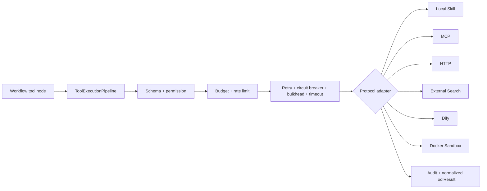

# Tool, MCP and Dify Runtime

Every protocol passes through `ToolExecutionPipeline`.

Tool definitions persist input/output schemas, protocol, version, risk, side effects, idempotency, timeout, retry policy, permissions and configuration. High/critical tools require explicit approval.

MCP supports standard HTTP JSON-RPC, JSON or SSE responses, initialization, discovery, health checks and `tools/call`. Synced tools use `mcp:{serverCode}:{toolName}` and are persisted as published Tool versions. MCP registration requires `ADMIN` plus `MCP_MANAGE`.

HTTP tools build requests from administrator-controlled `allowedHost`, method and templates. Redirects, `file://`, loopback, link-local and private addresses are rejected unless an administrator explicitly enables a trusted internal host. Response content type and byte size are bounded.

Dify supports blocking and streaming workflow responses, secret references, run/user correlation and normalized errors. Dify is never the source of truth for Agent configuration, permissions or run history.

Docker sandbox runs one workspace per run with network disabled, CPU/memory/PID/time/disk budgets, image validation and a command allow-list. It uses `ProcessBuilder` with fixed Docker flags, never `Runtime.exec` on user input. Result files become authenticated MinIO artifacts.
