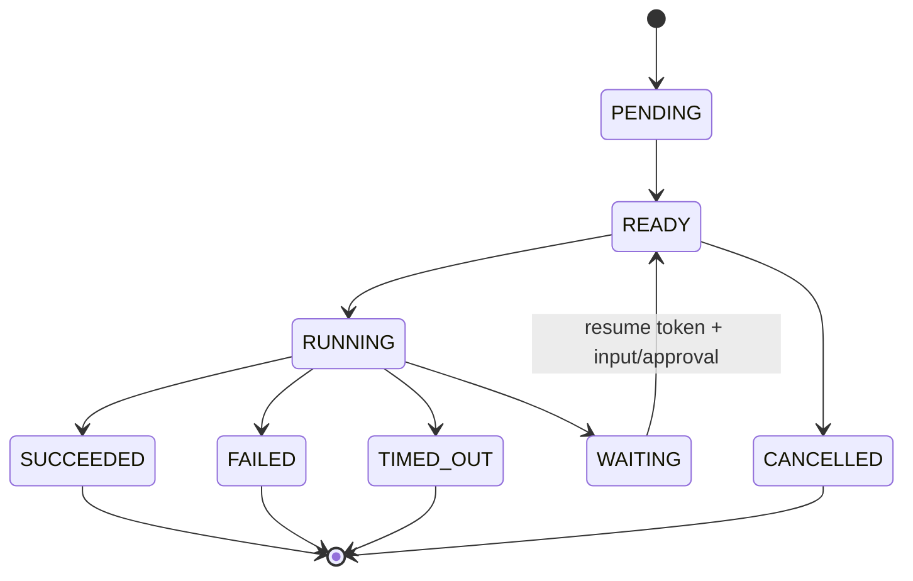

# Workflow Runtime

Workflow versions contain nodes, edges, schemas and execution policy. Publication validates one START, at least one END, reachability, references, bounded loops, branch DSL, parallel joins and dependency publication.

Implemented executors cover validation, normalization, intent/entity processing, retrieval, model/tool/MCP/Dify calls, transforms, branch, parallel, join, foreach, loop, human feedback/approval, output validation, artifacts and end nodes.

The branch DSL only reads workflow variables and supports `eq`, `ne`, `gt`, `gte`, `lt`, `lte`, `contains`, `in`, `and`, `or`, `not`, `exists` and `empty`. It does not execute Java, JavaScript, Groovy or unrestricted SpEL.

Parallel and foreach work use a bounded executor, ordered result collection, timeout/failure policy and cancellation propagation. Loop nodes require `maxIterations`, termination condition and per-iteration limits. Waiting nodes persist resume-token hashes and resume from the paused state instead of replaying the whole workflow.
