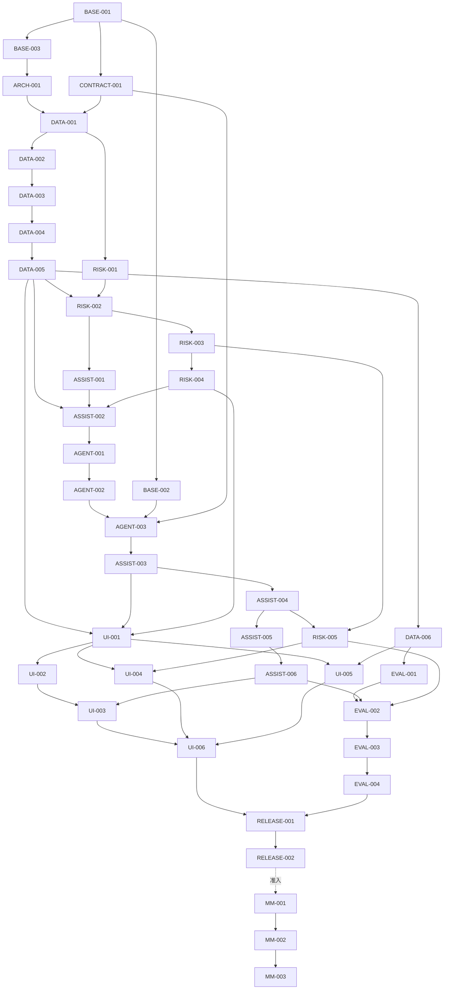

# 美妆客服共情副驾连续执行实施计划

> 本文是从当前目标架构进入工程实现阶段的执行控制文档。它不是愿景说明，也不替代领域词汇表、ADR、OpenAPI 或机器契约。

## 0. 文档元数据

| 字段 | 值 |
| --- | --- |
| 状态 | `ACTIVE` |
| 计划版本 | `1.1` |
| 建立日期 | `2026-07-26` |
| 最近复核 | `2026-07-27` |
| DATA-003 功能提交 | `DATA-003: add staged import preview and confirmation API`（本提交） |
| 当前执行阶段 | M1 进行中；`DATA-003=DONE`，`DATA-004`、`RISK-001=READY` |
| 目标仓库 | `https://github.com/makabaka165/tianchi_LOREAL_comp1.git` |
| 第一条演示链路 | 会话 `S00082`，不良反应风险场景 |
| 默认技术路线 | Java 模块化单体负责业务、编排和运行时；Python 只用于离线实验或可替换的无状态 AI 能力 |
| 计划维护者 | 当前任务执行者；每个任务完成时同步更新状态、证据和偏差 |

### 0.1 权威输入及优先级

发生冲突时按以下顺序处理；低优先级文档不得覆盖高优先级约束。

1. [上下文地图](../../CONTEXT-MAP.md)及四个 `docs/domain/**/CONTEXT.md`：领域语言和上下文所有权。
2. [目标架构](../architecture/beauty-service-copilot.md)：目标范围、聚合不变量、Java/Python 边界和阶段目标。
3. [ADR 0005](../adr/0005-java-orchestrates-python-provides-capabilities.md)、[ADR 0006](../adr/0006-ai-proposes-domain-policies-decide.md)、[ADR 0007](../adr/0007-typed-facts-rag-for-unstructured-knowledge.md)：已接受且不可由普通任务绕过的架构决策。
4. [辅助输出契约](../contracts/customer-service-assistance-output.schema.json)和 [OpenAPI](../api/openapi.yaml)：机器可验证契约。
5. 本实施计划：任务顺序、建议文件、验收、回滚和交付门禁。
6. 赛题原始材料：位于仓库外的 `E:\tianchi_LOREAL\comp1`，只作为本地输入，不纳入 Git。

原始材料指纹固定如下。发现文件哈希变化时，停止导入实现和评测，先重新建立数据基线。

| 文件 | SHA-256 |
| --- | --- |
| `赛题 1：数据共情者-业务数据.xlsx` | `B5AC027E863C5580DAB39C8F459E4698D65E9FBEC29832C9915448F2087307B7` |
| `赛题 1：数据共情者-客服工作台示说明.docx` | `A4C1417F198E48BEDFEE1846D6174F2F4C1B858013729BBD0BC9035BDA221D55` |
| `赛题一：数据共情者 - 消费者的AI管家.md` | `0638DEF73FD278B21060B0C6367CF61E5B482CA71A19C5539749C8809BEE8882` |

### 0.2 适用范围

本计划覆盖：

- `com.hmdp.servicedata`、`com.hmdp.serviceassist`、`com.hmdp.riskops` 三个新业务上下文；
- 现有 `com.hmdp.ai` Agent 平台的受控扩展点，不重写 Runtime；
- 客服数据导入、三栏工作台、辅助建议、建议采纳、风险预警闭环；
- competition profile、权限、Feature Flag、自动化测试、离线评测、演示与发布材料；
- 可选多模态和 Python capability service 的准入验证。

本计划不覆盖：

- Java 11、Spring Boot 2.7、LangChain4j 0.30 的主版本升级；
- 微服务拆分或全部遗留本地生活代码清理；
- 真实退款、打款、订单修改、工单关闭或自动对消费者发送消息；
- 把结构化订单、服务工单和风险状态改为向量检索主路径；
- 在缺少真实图片附件时宣称已完成原生视觉闭环。

### 0.3 变更规则

- 领域词义改变：先修改相应 `CONTEXT.md`，必要时新增 ADR，再修改本计划。
- 不可逆、反直觉且存在真实取舍的架构改变：新增 ADR，不在任务卡中暗改。
- API 或 JSON 字段改变：先改 Schema/OpenAPI 和契约测试，再改实现。
- Flyway 文件一旦进入任何共享环境不得修改，只能追加更高版本迁移。
- 含 Flyway 的任务只有在所有更低版本迁移任务均为 `DONE` 后才能进入 `IN_PROGRESS`，即使业务依赖本可并行。
- 任务新增、拆分或取消时，必须同步更新任务总表、DAG、关键路径和迁移账本。
- 任务状态只能按 `BLOCKED -> READY -> IN_PROGRESS -> DONE` 推进；取消使用 `DEFERRED`，失败后等待处理使用 `BLOCKED`。
- 每个任务必须留下可复现验证命令和证据；“人工看起来正常”不能作为唯一完成证据。

## 1. 当前实现到目标实现的变化地图

| 范围 | 当前实现 | 下一阶段目标 | 实施入口 |
| --- | --- | --- | --- |
| Agent 平台 | Agent Run、Workflow、Tool、RAG、Memory、SSE、Evaluation 已存在 | 复用平台，新增客服只读 Tools、已发布工作流和结果消费适配器 | `AGENT-*`、`ASSIST-*` |
| Run 完成回调 | `RunCompletionObserver` 在 `runs.complete(...)` 之前同步调用；Observer 异常会使 Run 失败 | 客服 Observer 只做过滤和幂等入箱、永不抛错；异步处理并补偿扫描 | `ASSIST-004` |
| 服务数据 | 无客服会话、订单快照、服务工单领域表 | 可预览、可确认、幂等、标签隔离的 XLSX 导入和只读查询 | `DATA-*` |
| 接待辅助 | 无上下文快照、辅助请求、建议和采纳决定 | 快照不可变、建议可过期、输出有证据、人工决定可审计 | `ASSIST-*` |
| 风险运营 | 无风险信号、预警、SLA 和处置记录 | 确定性等级下限、归并、乐观锁状态机和完整闭环 | `RISK-*` |
| 安全 | `/api/v1/**` 由 AI 专用拦截器保护 | 客服 API 使用通用 scope + 客服权限，不让服务数据依赖 AI 领域包 | `BASE-003` |
| 前端 | 只有 `/studio` 的 Agent/Run 主链路 | `/service` 三栏工作台、风险看板、数据导入；Studio 仍用于调试 | `UI-*` |
| 运行配置 | `local/test/prod`，测试关闭 Flyway/RAG/Task/Recovery | 新增 `competition` profile 和明确的降级模式，默认不影响现有环境 | `BASE-002` |
| 评测 | 平台有通用 Evaluation，暂无赛题切分和指标 | 消费者级切分、三组基线、风险/事实/回复/性能指标和成本证据 | `EVAL-*` |
| Python | 只在脚本中辅助验证 | 默认仅用于 `experiments/`；多模态 sidecar 必须经过准入门 | `MM-*` |

## 2. 不可突破的架构边界

### 2.1 上下文依赖

```text
servicedata  <- serviceassist -> ai
                   |
                   v
                riskops

riskops -> serviceassist 仅通过“有效预警只读 DTO”反向提供投影
```

具体约束：

1. `com.hmdp.ai..` 不得依赖 `servicedata..`、`serviceassist..`、`riskops..`。
2. `servicedata..` 不得依赖另外三个上下文；尤其不能直接实现 `LocalSkill`。
3. `riskops.domain..` 不依赖 Agent 平台、Spring、JDBC 或 MyBatis。
4. 客服 Tool 适配器放在 `serviceassist.infrastructure.agent.tool`，通过提供方公开查询端口读取事实。
5. 跨上下文只传稳定 ID、值对象、事件和 DTO，不传 Entity、Mapper、Repository 或任意 JSON 查询能力。
6. 写事务不得跨越表前缀所有权；组合工作台只能在专用只读查询服务中汇总。
7. 不建立 `customer-common` 领域包。认证、租户和请求 scope 属于技术性共享基础设施，不属于客服领域模型。

### 2.2 数据和 AI 边界

- `scene_major`、`scene_minor`、目标消息标识及其他评测标签不得进入 `cs_data_*`、上下文快照、Tool 返回、Prompt、模型日志或 Run metadata。
- 订单号、工单号、物流号必须从读取到持久化全程使用 `String`。
- 赛题“一会话至多一订单/工单”只用于当前样本核对，数据库和领域模型仍按一对多设计。
- 模型只能产生意图/情绪判断、回复草稿、受限动作建议和带证据风险信号。
- 模型不能改变订单、服务工单或风险预警状态，不能自动发送消息，不能承诺退款/赔付，不能给出医学诊断。
- 规则确定的风险等级是下限，模型不得降低。
- 结构化实时事实只走类型化查询/Tool；RAG 只承载政策、SOP、产品说明等非结构化知识。

### 2.3 Agent 输出的双层契约

当前 Runtime 的最终类型是 `AgentRunOutput`，而现有客服 Schema 描述的是业务载荷，二者不能混用：

```text
AgentRunOutput                         由 Agent 平台拥有
└── blocks[0].data                    固定提取位置
    └── CustomerServiceAssistanceV1   由 serviceassist 拥有
```

实施时必须遵守：

1. `customer-service-assistance-output.schema.json` 是 Prompt 候选输出的权威业务 Schema，也是接待辅助落库前的严格校验；生成节点使用 `CAPTURE_FOR_GUARD` 时，局部校验失败被捕获供修复分支使用，不能视为校验通过。
2. 新增 `customer-service-agent-run-output.schema.json` 描述 `AgentRunOutput` 外层信封，并作为 Agent Version 的 `output_schema`。
3. `AssistanceCompletionProcessor` 只从已约定的 `blocks[0].data` 提取业务载荷，再执行一次严格 Schema、证据、事实和合规校验。
4. 不得把客服业务字段加入通用 `AgentRunOutput` Java 类，也不得让通用 Runtime 依赖客服 Schema。

### 2.4 Run 完成回调约束

`DefaultAgentRuntime` 当前顺序为：完成 Node -> `notifyCompletion` -> `runs.complete` -> 发布 `run.completed`。因此：

- 客服 `RunCompletionObserver` 必须先按 `agentId == agent-beauty-service-copilot` 过滤；
- 必须验证 Run metadata 中的 `assistanceRequestId`、`contextSnapshotId` 和 `contractVersion`；
- 回调只向 `cs_assist_completion_inbox` 执行 `INSERT IGNORE` 或等价幂等写入；
- 回调捕获并记录自身异常，禁止把异常抛回 Runtime；
- 异步 Processor 必须确认平台 Run 已为 `COMPLETED` 后才物化建议；
- 补偿扫描必须发现“已完成 Run 但无 Inbox/无 Suggestion”的请求，避免回调静默失败造成永久丢失；
- 不在本阶段调整所有 Observer 的全局语义，除非独立 ADR 和平台回归测试证明必要。

## 3. 连续执行协议

### 3.1 任务选择算法

每轮工程执行严格采用以下算法：

1. 读取本文件任务总表和目标任务卡。
2. 仅选择一个状态为 `READY` 的任务；关键路径任务优先于并行支线。
3. 确认所有“前置依赖”均为 `DONE`，工作树没有与目标文件重叠的未知改动。
4. 将任务改为 `IN_PROGRESS`，记录执行者、分支和开始时间。
5. 只完成该任务卡范围；发现新需求先记录为后续任务，不顺手扩张范围。
6. 运行任务卡中的定向测试，再运行其里程碑门禁。
7. 在任务卡“执行证据”中记录提交、命令、结果、迁移版本和已知偏差。
8. 全部 DoD 满足后改为 `DONE`；然后重新计算哪些 `BLOCKED` 任务可变为 `READY`。

任意时刻最多一个任务为 `IN_PROGRESS`。只有明确拆成互不写同一文件的任务后，才允许多人并行；本计划默认不并行。

### 3.2 每轮开始前的固定检查

```powershell
git status --short --branch
git rev-parse --short=12 HEAD
git diff --check
mvn -q -DskipTests compile
```

涉及前端时追加：

```powershell
Set-Location frontend
npm ci
npm run typecheck
```

涉及 Flyway 时先启动干净 MySQL 并执行完整迁移，不允许只手工执行当前 SQL：

```powershell
docker compose -f docker-compose.ai.yml up -d --wait
mvn -Dspring-boot.run.profiles=competition spring-boot:run
```

### 3.3 Git 和提交纪律

- `main` 只接收通过门禁的任务；建议分支名 `task/<TASK-ID>-<short-name>`。
- 一个任务至少一个独立提交，提交标题格式：`<TASK-ID>: <imperative summary>`。
- 原始 XLSX、DOCX、PPTX、真实 Token、模型密钥、登录 Token 和含 PII 的导入产物不得提交。
- 不修改既有已发布 Flyway；checksum 问题必须使用追加迁移或现有兼容脚本处理。
- 任务中生成的评测结果提交聚合指标和脱敏失败样本，不提交完整消费者原文。
- 合并前必须执行 `git diff --check` 并检查 `git status --short`，禁止把临时文件和 IDE 文件带入提交。

### 3.4 状态和执行证据模板

每张任务卡初始包含以下字段；执行时在卡片末尾追加证据，不删除原验收条件。

```markdown
- 执行者：
- 分支：
- 开始/结束：
- 提交：
- 验证命令与结果：
- 迁移结果：
- 偏差/后续任务：
```

## 4. 里程碑、DAG 和关键路径

### 4.1 里程碑

| 里程碑 | 目标 | 退出证据 |
| --- | --- | --- |
| M0 基线与边界 | profile、权限 scope、契约和 ArchUnit 骨架可用 | 基线测试通过；新包依赖规则生效；API/Schema 名称冻结 |
| M1 服务数据 | XLSX 可 dry-run、确认、幂等导入并形成工作台查询 | 138 会话、998 消息、113 订单、80 工单、112 别名；重复导入计数不变 |
| M2 `S00082` 纵向链路 | 快照 -> Run -> 结构化建议 -> 采纳 -> 高风险预警 | 实时模型和确定性 fallback 都能完成演示；证据可回溯 |
| M3 风险闭环 | 多风险类型、归并、SLA、负责人和命令 API | 状态机、版本冲突、重复信号和 SLA 测试通过 |
| M4 客服界面 | 三栏工作台、风险看板、导入页完整可操作 | 桌面/平板/手机 Playwright 通过，无遮挡和关键布局位移 |
| M5 评测与发布 | 三组基线、成本、演示脚本和答辩制品 | 指标可复现；一条命令启动；离线降级可用；发布检查清单通过 |
| M6 可选多模态 | 有真实或可追踪图片时验证增益 | 端到端图片证据、文本 fallback 和指标增益同时成立 |

### 4.2 依赖 DAG



### 4.3 关键路径

```text
BASE-001 -> BASE-003 -> ARCH-001 -> DATA-001 -> DATA-002 -> DATA-003
-> DATA-004 -> DATA-005 -> RISK-002 -> RISK-003 -> RISK-004
-> ASSIST-002 -> AGENT-001 -> AGENT-002 -> AGENT-003 -> ASSIST-003 -> ASSIST-004
-> ASSIST-005 -> ASSIST-006 -> UI-003 -> UI-006 -> RELEASE-001 -> RELEASE-002
```

若需要压缩时间，只允许并行以下支线：`BASE-002`、`CONTRACT-001`；`RISK-001` 与 `DATA-002`；`EVAL-001` 与 UI 基础工作。不得并行修改同一 Flyway Seed、OpenAPI 或共享前端路由。

## 5. 任务总表

`BASE-001` 是本文建立后的唯一初始 `READY` 任务。

| ID | 状态 | 里程碑 | 一句话结果 | 前置 |
| --- | --- | --- | --- | --- |
| BASE-001 | `DONE` | M0 | 固定代码、数据和测试基线 | 无 |
| BASE-002 | `DONE` | M0 | competition profile、Feature Flag 和降级配置 | BASE-001 |
| BASE-003 | `DONE` | M0 | 建立不依赖 AI 领域包的客服 scope 权限入口 | BASE-001 |
| ARCH-001 | `DONE` | M0 | 用 ArchUnit 固化四上下文依赖方向 | BASE-003 |
| CONTRACT-001 | `DONE` | M0 | 冻结 API、错误码、双层输出和风险枚举 | BASE-001 |
| DATA-001 | `DONE` | M1 | 服务数据 DDL、领域模型和 Repository 端口 | ARCH-001, CONTRACT-001 |
| DATA-002 | `DONE` | M1 | XLSX 解析、字段映射、校验和脱敏夹具 | DATA-001 |
| DATA-003 | `DONE` | M1 | dry-run、错误报告和确认导入 API | DATA-002 |
| DATA-004 | `READY` | M1 | 幂等提交、来源链接和消费者受限归并 | DATA-003 |
| DATA-005 | `BLOCKED` | M1 | 服务轨迹和工作台组合查询 | DATA-004 |
| DATA-006 | `BLOCKED` | M1 | 官方数据全量导入验收和标签泄漏门禁 | DATA-005 |
| RISK-001 | `READY` | M2/M3 | 风险信号、预警、处置记录 DDL 与状态机 | DATA-001 |
| RISK-002 | `BLOCKED` | M2 | 确定性特征、风险策略和等级下限 | RISK-001, DATA-005 |
| RISK-003 | `BLOCKED` | M2/M3 | 风险信号接收、归并、SLA 和新旧预警关联 | RISK-002 |
| RISK-004 | `BLOCKED` | M3 | 风险读取和乐观锁命令 API | RISK-003 |
| RISK-005 | `BLOCKED` | M2/M3 | 接入辅助结果并完成 `S00082` 风险闭环 | RISK-003, ASSIST-004 |
| ASSIST-001 | `BLOCKED` | M2 | 辅助快照、请求、建议、决定和完成入箱模型 | RISK-002, CONTRACT-001 |
| ASSIST-002 | `BLOCKED` | M2 | 创建不可变证据快照和内容哈希 | ASSIST-001, DATA-005, RISK-004 |
| AGENT-001 | `BLOCKED` | M2 | 实现客服只读 Local Skills 和输出 Guard Skill | ASSIST-002 |
| AGENT-002 | `BLOCKED` | M2 | 增加通用候选输出捕获和受限修复扩展点 | AGENT-001 |
| AGENT-003 | `BLOCKED` | M2 | Seed Tool、Prompt、Workflow、Agent 和绑定 | AGENT-002, BASE-002, CONTRACT-001 |
| ASSIST-003 | `BLOCKED` | M2 | 发起辅助请求并可靠创建 Agent Run | ASSIST-002, AGENT-003 |
| ASSIST-004 | `BLOCKED` | M2 | 完成入箱、严格物化、幂等和补偿扫描 | ASSIST-003 |
| ASSIST-005 | `BLOCKED` | M2 | 采纳、编辑后采纳、拒绝和冲突校验 | ASSIST-004 |
| ASSIST-006 | `BLOCKED` | M2 | 建议过期、失败降级和全链路恢复 | ASSIST-005 |
| UI-001 | `BLOCKED` | M4 | 客服前端路由、契约、transport 和 query keys | DATA-005, RISK-004, ASSIST-003 |
| UI-002 | `BLOCKED` | M4 | 三栏工作台骨架和会话浏览 | UI-001 |
| UI-003 | `BLOCKED` | M4 | SSE 辅助面板、证据与建议采纳交互 | UI-002, ASSIST-006 |
| UI-004 | `BLOCKED` | M4 | 风险看板、详情时间线和闭环命令 | UI-001, RISK-005 |
| UI-005 | `BLOCKED` | M4 | 导入预览、错误报告和确认页面 | UI-001, DATA-006 |
| UI-006 | `BLOCKED` | M4 | 响应式、无障碍、错误态和 Playwright 验收 | UI-003, UI-004, UI-005 |
| EVAL-001 | `BLOCKED` | M5 | 消费者级数据切分和 provenance 账本 | DATA-006 |
| EVAL-002 | `BLOCKED` | M5 | 指标实现、固定评测 Runner 和失败样本 | EVAL-001, ASSIST-006, RISK-005 |
| EVAL-003 | `BLOCKED` | M5 | 三组基线和消融实验 | EVAL-002, AGENT-003 |
| EVAL-004 | `BLOCKED` | M5 | 延迟、Token、成本、降级率和答辩图表 | EVAL-003 |
| RELEASE-001 | `BLOCKED` | M5 | 一键启动、演示账号、健康检查和验收脚本 | UI-006, EVAL-004 |
| RELEASE-002 | `BLOCKED` | M5 | 发布清单、PPT/视频证据和 main 门禁 | RELEASE-001 |
| MM-001 | `DEFERRED` | M6 | 获取或构造有 provenance 的图片样本 | RELEASE-002 后准入 |
| MM-002 | `DEFERRED` | M6 | Java 视觉与 Python sidecar 小型对比 | MM-001 |
| MM-003 | `DEFERRED` | M6 | 仅在有增益时接入多模态和文本 fallback | MM-002 |

## 6. Flyway 精确迁移账本

最新已存在迁移为 `V20260723_05__enforce_global_knowledge_index_codes.sql`。下一阶段只能从以下序列追加：

| 顺序 | 文件 | 所属任务 | 内容 | 禁止事项 |
| --- | --- | --- | --- | --- |
| 1 | `V20260726_01__customer_service_permissions.sql` | BASE-003 | 六类客服权限和 admin 角色绑定 | 不写明文密码或 Token |
| 2 | `V20260726_02__customer_service_data_schema.sql` | DATA-001 | `cs_data_*` 表、唯一键和索引 | 不加入评测标签列 |
| 3 | `V20260726_03__customer_service_risk_schema.sql` | RISK-001 | `cs_risk_*` 表、版本和归并索引 | 不外键到 `ai_*`/`cs_assist_*` |
| 4 | `V20260726_04__customer_service_competition_policies.sql` | RISK-002 | 风险策略/SLA 初值和演示 scope 授权 | 不把阈值只写进 Prompt |
| 5 | `V20260726_05__customer_service_assistance_schema.sql` | ASSIST-001 | `cs_assist_*` 表和 completion inbox | 不复制模型隐藏推理 |
| 6 | `V20260726_06__beauty_service_copilot_tools.sql` | AGENT-003 | Local Tool 定义、版本和 Schema | Tool 全部 `side_effect=0` |
| 7 | `V20260726_07__beauty_service_copilot_prompt_workflow.sql` | AGENT-003 | Prompt、Workflow、节点、边 | 不引用未发布版本 |
| 8 | `V20260726_08__beauty_service_copilot_agent_bindings.sql` | AGENT-003 | Agent Version、Tool/Knowledge 绑定 | 不原地修改已发布版本 |

约束：

- 每个业务表必须含 `tenant_id`、`workspace_id`、`created_at`；可变聚合必须含 `updated_at` 和 `version`。
- 所有唯一键必须包含租户/工作空间或通过父级唯一键间接保证 scope 隔离。
- 只允许上下文内部外键；为了兼容现有风格可以不用数据库外键，但 Repository 必须验证归属。
- Seed 使用稳定 ID 和 `INSERT IGNORE`/受控 upsert；发布内容的 `content_hash` 必须由脚本计算，不接受占位值。
- 新增迁移必须在空库和已经运行到 `V20260723_05` 的升级库各验证一次。
- 任意迁移失败，不使用手工删 `flyway_schema_history` 的方式绕过；按 [本地开发文档](../operations/local-development.md) 和既有修复脚本处理。

## 7. 目标包、表、路由和测试索引

### 7.1 后端包

```text
src/main/java/com/hmdp/
├── servicedata/{api,application,domain,infrastructure}
├── serviceassist/{api,application,domain,infrastructure}
├── riskops/{api,application,domain,infrastructure}
└── security/customer/                  # 客服 scope 权限技术入口，不放领域对象
```

建议公开契约位置：

- `servicedata.application.port.in.ServiceJourneyQuery`
- `servicedata.application.contract.ServiceJourneyView`
- `riskops.application.port.in.ActiveRiskAlertQuery`
- `riskops.application.contract.ActiveRiskAlertView`
- `riskops.application.port.in.SubmitRiskSignalUseCase`
- `serviceassist.application.port.out.AgentRunCommandPort`

### 7.2 表所有权

```text
cs_data_import_batch
cs_data_import_staging
cs_data_import_error
cs_data_consumer
cs_data_consumer_alias
cs_data_conversation
cs_data_message
cs_data_order_snapshot
cs_data_service_case
cs_data_source_link

cs_risk_policy
cs_risk_signal
cs_risk_alert
cs_risk_alert_signal
cs_risk_disposition

cs_assist_context_snapshot
cs_assist_request
cs_assist_suggestion
cs_assist_decision
cs_assist_completion_inbox
```

### 7.3 API 路由

```text
POST /api/v1/customer-service/imports/preview
GET  /api/v1/customer-service/imports/{batchId}
GET  /api/v1/customer-service/imports/{batchId}/errors
POST /api/v1/customer-service/imports/{batchId}/confirm

GET  /api/v1/customer-service/conversations
GET  /api/v1/customer-service/conversations/{conversationId}/workspace
POST /api/v1/customer-service/conversations/{conversationId}/assistance-requests
GET  /api/v1/customer-service/assistance-requests/{requestId}
POST /api/v1/customer-service/suggestions/{suggestionId}/decisions

GET  /api/v1/customer-service/risk-alerts
GET  /api/v1/customer-service/risk-alerts/{alertId}
POST /api/v1/customer-service/risk-alerts/{alertId}/acknowledge
POST /api/v1/customer-service/risk-alerts/{alertId}/assign
POST /api/v1/customer-service/risk-alerts/{alertId}/start
POST /api/v1/customer-service/risk-alerts/{alertId}/resolve
POST /api/v1/customer-service/risk-alerts/{alertId}/dismiss
```

### 7.4 前端模块

```text
frontend/src/modules/
├── service-workbench/
├── service-data-import/
└── risk-alerts/

frontend/src/app/routes/customer-service-routes.tsx
frontend/src/app/layouts/CustomerServiceLayout.tsx
```

### 7.5 测试类最低集合

```text
CustomerServiceModuleBoundaryTest
CompetitionProfileContextTest
CustomerServicePermissionInterceptorTest
CompetitionWorkbookParserTest
ServiceDataImportApplicationServiceTest
ServiceDataImportIntegrationTest
ServiceJourneyQueryIntegrationTest
RiskAlertStateMachineTest
RiskAlertDeduplicationIntegrationTest
AssistanceSnapshotServiceTest
BeautyServiceLocalSkillTest
BeautyServiceWorkflowSeedIntegrationTest
AssistanceCompletionProcessorIntegrationTest
SuggestionDecisionApplicationServiceTest
S00082VerticalSliceIntegrationTest
CustomerServiceOpenApiContractTest
```

## 8. M0 任务卡：基线、配置、权限、边界和契约

### BASE-001 固定代码、数据和测试基线

- **状态**：`DONE`
- **目标**：证明下一阶段是在可重复的代码和赛题数据基线上开始，避免把既有失败误判为新实现回归。
- **前置依赖**：无。
- **现有代码/资产**：`main@39ee0b3a259a`；根目录外三份赛题材料；`mvn clean verify`、前端四项检查和四条 GitHub Actions 工作流。
- **新增/修改文件**：新增 `docs/implementation/evidence/m0-baseline.md`；可新增 `scripts/customer-service/verify-source-baseline.ps1`，不得复制原始材料。
- **数据库/API/事件契约**：无契约变化；记录当前 Flyway 最高版本 `V20260723_05`。
- **具体步骤**：
  1. 记录 `git status`、HEAD、JDK、Maven、Node、npm、Docker 版本。
  2. 使用 `Get-FileHash -Algorithm SHA256` 核对本文件 0.1 节三项指纹。
  3. 运行后端单元门禁；若失败，记录失败测试、堆栈摘要和是否与本阶段无关，未解决前不得开始业务代码。
  4. 运行前端 lint、typecheck、test、build，记录用时和结果。
  5. 用干净基础设施运行 full integration；记录 Docker 镜像版本和 Flyway 成功版本。
  6. 记录官方数据预期：138 会话、998 消息、112 消费者别名、113 订单、80 服务工单、29 个仅有路径但缺失的图片引用。
  7. 确认 `.gitignore` 覆盖本地原始数据目录、导入临时文件、评测明细和模型密钥。
- **测试命令**：

  ```powershell
  mvn clean verify
  mvn clean verify -Pfull-integration
  Set-Location frontend
  npm ci
  npm run lint
  npm run typecheck
  npm run test
  npm run build
  ```

- **验收标准**：证据文档能在另一台机器复现；哈希完全一致；现有后端和前端门禁通过；若存在基线失败，已有独立阻塞项且本任务保持未完成。
- **回滚方式**：只删除本任务新增的证据/脚本；不改生产代码和数据库。
- **Definition of Done**：证据文件已提交；总表中 `BASE-001=DONE`，`BASE-002`、`BASE-003`、`CONTRACT-001` 解锁为 `READY`。
- **执行证据**：
  - 执行者：Claude（连续执行会话）
  - 分支：`main`（本地，未推送）
  - 开始/结束：2026-07-26 21:25 / 2026-07-26 21:50 (+08:00)
  - 提交：`BASE-001: repair red baseline gates and record M0 baseline evidence`
  - 验证命令与结果：三份原始材料 SHA-256 与 0.1 节一致；`mvn clean verify` 首跑 `Tests run: 700, Failures: 4`（全部为基线自带缺陷，详见 evidence 第 4 节），修复后全绿；`mvn clean verify -Pfull-integration` BUILD SUCCESS（failsafe 22/22，MySQL 8.0.36 + redis:7.2-alpine，Flyway 至 v20260723.05）；前端 `npm ci`（修复 lock 失步后）/`lint`/`typecheck`/`test`（13/13）/`build` 全部通过。
  - 迁移结果：无新增迁移；记录现有最高版本 `V20260723_05`。
  - 偏差/后续任务：本机 JDK 17 编译至 Java 11 目标；`npm ci` 首次失败因 package-lock 缺 `@emnapi/*` 可选依赖，已用 `npm install` 同步并提交 lock；4 个基线失败按计划第 18 节第 1 条修复而非绕过（`SessionBootstrapApplicationService` 改 JdbcTemplate 查 `tb_user`、权限扫描测试增加带 `@SaCheckLogin` 前提的显式豁免清单、README 补回初始化与端口章节）；`temp_diff.txt` 从基线移除并加入 .gitignore。详细证据见 [m0-baseline.md](evidence/m0-baseline.md)。

### BASE-002 competition profile、Feature Flag 和降级配置

- **状态**：`DONE`
- **目标**：以独立 profile 启用客服垂直能力，不改变 `local`、`test`、`prod` 的默认行为，并使现场演示可显式选择实时模型或降级链路。
- **前置依赖**：BASE-001。
- **现有代码/资产**：`application.yaml`、`application-local.yaml`、`application-test.yaml`；现有 `hmdp.ai.*` 条件配置；`docker-compose.ai.yml`。
- **新增/修改文件**：
  - 新增 `src/main/resources/application-competition.yaml`；
  - 新增 `com.hmdp.serviceassist.infrastructure.config.CustomerServiceProperties`；
  - 新增 `CompetitionProfileContextTest`；
  - 修改 `.env.example` 和 `docs/operations/local-development.md`，只添加非敏感配置说明。
- **数据库/API/事件契约**：关闭功能时客服 API 返回稳定错误 `CS_FEATURE_DISABLED`；不能表现为 404 或空白页。
- **具体步骤**：
  1. 在 `application.yaml` 把 `hmdp.customer-service.enabled`、`import.enabled`、`assistance.enabled`、`risk.enabled` 默认设为 `false`。
  2. 在 competition profile 启用前三项，保留 `rag.enabled` 可配置；不删除 Redis Stack/MinIO 适配器。
  3. 定义 `assistance.mode=LIVE|DETERMINISTIC_FALLBACK|DEMO_FIXTURE`。`DEMO_FIXTURE` 只能在 competition profile 且响应明确标注 `generationMode` 时使用。
  4. 定义模型超时、单次 Run Token 上限、最大并发、fallback 开关、completion 扫描间隔和导入 staging TTL。
  5. 将赛题目录通过 `HMDP_CS_SOURCE_ROOT` 配置，代码不得硬编码 `E:` 路径。
  6. 生产 profile 检测到 `DEMO_FIXTURE` 时启动失败；没有模型密钥时 LIVE 模式健康检查显示 `DEGRADED`，工作台仍可读取事实。
  7. 增加 `/actuator/health` 客服子组件：数据库、Agent Seed、模型能力、fallback 状态分别报告，不暴露密钥。
- **建议配置**：

  ```yaml
  hmdp:
    customer-service:
      enabled: true
      import:
        enabled: true
        staging-ttl-hours: 24
      assistance:
        enabled: true
        mode: ${HMDP_CS_ASSISTANCE_MODE:LIVE}
        fallback-enabled: ${HMDP_CS_FALLBACK_ENABLED:true}
        completion-scan-delay-ms: 5000
      risk:
        enabled: true
        sla-scan-enabled: true
  ```

- **测试命令**：`mvn -Dtest=CompetitionProfileContextTest test`；`mvn -Dspring.profiles.active=test test`。
- **验收标准**：默认 profile 不创建客服 Controller/Worker；competition profile 创建全部 Bean；无 AI key 时可启动并明确降级；prod + fixture 组合启动失败。
- **回滚方式**：关闭总开关；移除 competition profile 不影响既有 profile。
- **Definition of Done**：配置元数据、环境变量说明、条件 Bean 测试和健康状态全部可验证。
- **执行证据**：
  - 执行者：Claude（连续执行会话）
  - 分支：`main`
  - 开始/结束：2026-07-26 21:55 / 22:15 (+08:00)
  - 提交：`BASE-002: add competition profile, feature flags and degradation config`
  - 验证命令与结果：`CompetitionProfileContextTest`（7 用例：默认全关、competition 值绑定、health 细节、禁用 503、启用放行、非客服路径不受影响）与 `SecurityStartupGuardTest`（10 用例，含 prod 拒绝 DEMO_FIXTURE、接受 LIVE/DETERMINISTIC_FALLBACK）全部通过。
  - 迁移结果：无迁移。
  - 偏差/后续任务：`CS_FEATURE_DISABLED` 由始终注册的 `CustomerServiceFeatureGateFilter`（`com.hmdp.security.customer`）以 503 返回——拦截器在无 handler 时不会执行，Filter 才能保证"不表现为 404"；`CustomerServiceProperties` 位于计划建议的 `serviceassist.infrastructure.config`，Filter 为避免跨包依赖直接用 `@Value` 读主开关；prod+fixture 校验放入既有 `SecurityStartupGuard`（复用既定 prod 安全模式）；health 子组件目前报告开关与模式，Agent Seed/模型能力细节待 AGENT-003 后补；competition profile 全量真机启动验证与首个客服 Controller（DATA-003）的集成测试一起做。

### BASE-003 建立客服 scope 权限入口

- **状态**：`DONE`
- **目标**：复用登录、租户和 workspace 事实，但不让 `servicedata` 或 `riskops` 依赖 `com.hmdp.ai.domain.security`。
- **前置依赖**：BASE-001。
- **现有代码/资产**：`AiPermissionInterceptor` 覆盖 `/api/v1/**`；`AiAuthorizationService` 只识别 `AiPermission`；`SessionBootstrapApplicationService` 从 `ai_workspace_member` 返回 scope。
- **新增/修改文件**：
  - 新增 `com.hmdp.security.customer.CustomerServicePermission`；
  - 新增 `RequireCustomerServicePermission`、`CustomerServicePermissionInterceptor`、`CustomerServiceScopeContext`、`CustomerServiceScopeContextHolder`；
  - 修改 `MvcConfig`，客服路径由客服拦截器处理，并从 AI 拦截器排除；
  - 新增迁移 `V20260726_01__customer_service_permissions.sql`；
  - 新增 `CustomerServicePermissionInterceptorTest` 和 scope 隔离集成测试。
- **数据库/API/事件契约**：权限码固定为 `cs:data:import`、`cs:workspace:read`、`cs:assist:request`、`cs:suggestion:decide`、`cs:risk:read`、`cs:risk:manage`。所有客服 API 仍要求 Bearer Token、`X-Tenant-Id`、`X-Workspace-Id`。
- **具体步骤**：
  1. 权限枚举保存外部权限码，不复用 `AiPermission.name()` 推导。
  2. 拦截器先验证登录，再验证两个 scope header 和有效 workspace membership，最后通过 `StpInterface` 验证权限码或 `*`。
  3. 仅在请求线程中保存 `userId/tenantId/workspaceId/permissions`，在正常、异常和异步切换时清理 ThreadLocal。
  4. `MvcConfig` 对 `/api/v1/customer-service/**` 注册客服拦截器；`AiPermissionInterceptor` 明确 exclude 同一路径，避免双重上下文和错误权限。
  5. SQL 插入六项 `sys_permission`，绑定 `admin` 角色；普通客服/风险角色的最终映射留给 RELEASE-001，但测试夹具必须覆盖最小权限。
  6. 测试未登录、缺 header、非成员、权限不足、跨 workspace、admin wildcard、正常访问和 ThreadLocal 清理。
  7. Session bootstrap 应继续展示完整权限码，使前端 `can('cs:...')` 可直接判断。
- **测试命令**：`mvn -Dtest=CustomerServicePermissionInterceptorTest,SessionBootstrapApplicationServiceTest test`；full integration 验证迁移。
- **验收标准**：客服包不引用 `com.hmdp.ai.domain.security`；跨 workspace ID 即使对象 ID 存在也返回无权或资源不存在；所有 Controller 显式声明权限。
- **回滚方式**：Feature Flag 关闭客服路由；撤销代码使用追加迁移禁用权限，不删除已应用权限记录。
- **Definition of Done**：权限迁移在空库/升级库成功，安全回归清单通过，`ARCH-001` 可开始。
- **执行证据**：
  - 执行者：Claude（连续执行会话）
  - 分支：`main`
  - 开始/结束：2026-07-26 21:52 / 22:10 (+08:00)
  - 提交：`BASE-003: add customer service scope permission entry point`
  - 验证命令与结果：`CustomerServicePermissionInterceptorTest`（12 用例：未登录/缺声明/缺 header/空 header/非成员/跨 workspace/权限不足/正常/wildcard/方法级注解/ThreadLocal 清理/非 HandlerMethod）、`SessionBootstrapApplicationServiceTest`（7 用例，含 cs:* 权限码暴露与 wildcard）、`SessionBootstrapInterceptorExclusionTest`（AI 拦截器排除客服路径 + 客服拦截器注册）全部通过；`mvn clean verify -Pfull-integration` BUILD SUCCESS（22/22）；`CustomerServicePermissionSchemaIT` 在全新容器走完整分段迁移链（含 MySQL8 兼容桥 = 升级路径等价物）后断言 6 个权限 + admin 绑定，并重放 seed 证明幂等。
  - 迁移结果：`V20260726_01__customer_service_permissions.sql` 应用成功；seed 采用 `ON DUPLICATE KEY UPDATE` + `INSERT IGNORE`。
  - 偏差/后续任务：普通客服/风险角色映射按计划推迟到 RELEASE-001；`SessionBootstrap` 通过 `StpUtil.getPermissionList()` 暴露 `cs:*` 权限码（wildcard `*` 展开为全部六项），供前端 `can('cs:...')`。

### ARCH-001 用 ArchUnit 固化四上下文边界

- **状态**：`DONE`
- **目标**：把上下文地图从文档约定变成编译期自动门禁。
- **前置依赖**：BASE-003。
- **现有代码/资产**：`src/test/java/com/hmdp/arch/AiModuleBoundaryTest.java` 已限制 AI 包依赖和循环。
- **新增/修改文件**：新增 `CustomerServiceModuleBoundaryTest.java`；必要时只为通用安全包调整 `AiModuleBoundaryTest` 的允许集合。
- **数据库/API/事件契约**：无。
- **具体步骤**：
  1. 规则：`ai..` 不依赖三个客服上下文。
  2. 规则：`servicedata..` 不依赖 `serviceassist..`、`riskops..`、`ai..`。
  3. 规则：`riskops.domain..` 不依赖 `ai..`、Spring、JDBC、MyBatis 和其他基础设施包。
  4. 规则：`..api..` 不直接依赖 `..infrastructure..`、Mapper 或 Repository。
  5. 规则：跨上下文不得依赖对方的 `domain.entity`、`infrastructure`、`mapper`、`repository` 包。
  6. 规则：三个新顶层 slice 无循环；serviceassist 只能依赖 servicedata/riskops 的 `application.contract` 或 `application.port.in`。
  7. 先用最小空包/marker class 证明规则会运行，再写一个测试内故意违规样例验证规则能失败，最后移除违规样例。
- **测试命令**：`mvn -Dtest=AiModuleBoundaryTest,CustomerServiceModuleBoundaryTest test`。
- **验收标准**：每条规则有可理解的失败信息；新增客服实现无法绕过边界；没有通过宽泛 `ignoreDependency` 掩盖问题。
- **回滚方式**：不得为通过测试删除规则；只能回滚造成错误依赖的实现。若规则本身错误，先修订上下文地图并记录原因。
- **Definition of Done**：架构测试进入 `mvn clean verify`，后续包骨架只能按规则扩展。
- **执行证据**：
  - 执行者：Claude（连续执行会话）
  - 分支：`main`
  - 开始/结束：2026-07-26 22:35 / 22:50 (+08:00)
  - 提交：`ARCH-001: enforce customer service context boundaries with ArchUnit`
  - 验证命令与结果：`CustomerServiceModuleBoundaryTest` 13 条规则通过（ai 不依赖三上下文、servicedata/riskops 零外部上下文依赖、riskops.domain 纯净、serviceassist 只用对方 application 公开面、四包不用 ai.domain.security、不碰 legacy mapper/entity、api 不进 infrastructure、security.customer 中立、三上下文切片无环）；`AiModuleBoundaryTest` 回归通过。按步骤 7 用临时违规类（serviceassist 引 AiPermission）验证规则确实失败后移除。
  - 迁移结果：无迁移。
  - 偏差/后续任务：servicedata/riskops 尚为空包，相关规则使用 `allowEmptyShould(true)`，首个类出现即生效；serviceassist、security.customer 已有真实类被规则实际分析；无需调整 `AiModuleBoundaryTest` 允许集合（ai -> security.customer 属技术共享基础设施且未被禁止）。

### CONTRACT-001 冻结 API、错误码和双层输出契约

- **状态**：`DONE`
- **目标**：让后端、前端、Workflow Seed、评测和演示围绕同一组可验证契约开发。
- **前置依赖**：BASE-001。
- **现有代码/资产**：客服业务输出 Schema 已存在；OpenAPI 尚无客服路径；`ErrorCode` 有 AI 段；Runtime 外层为 `AgentRunOutput`。
- **新增/修改文件**：
  - 新增 `docs/contracts/customer-service-agent-run-output.schema.json`；
  - 新增 `docs/contracts/customer-service-assistance-input.schema.json`；
  - 修改 `docs/api/openapi.yaml`；
  - 修改 `ErrorCode.java`，新增客服错误段；
  - 新增 `CustomerServiceSchemaContractTest`、`CustomerServiceOpenApiContractTest`。
- **数据库/API/事件契约**：冻结第 7.3 节路由；风险类型、等级、状态、建议决定和 `generationMode` 必须为枚举；ID/编号均为 string。
- **具体步骤**：
  1. 输入 Schema 只允许 `conversationId`、`contextSnapshotId`、`assistanceRequestId` 和必要的 locale；不接受 `scene_*` 或任意透传 map。
  2. 外层 Schema 要求 `blocks[0].data.contractVersion=1.0`，并允许平台 usage/warnings/citations；不要复制业务 Schema 字段定义，使用 `$ref`。
  3. OpenAPI 为创建辅助返回 `202`，包含 `requestId/snapshotId/status/agentRunId?`；Run 绑定前允许 `agentRunId=null`。
  4. 决定请求固定为 `ACCEPT|ACCEPT_WITH_EDIT|REJECT`；编辑后采纳要求 `finalText`，其余类型禁止 `finalText`。
  5. 风险命令请求都携带 `expectedVersion`；assign 额外携带 `assigneeId`，resolve/dismiss 要求 reason。
  6. 定义错误：`CS_FEATURE_DISABLED`、`CS_RESOURCE_NOT_FOUND`、`CS_IMPORT_VALIDATION_FAILED`、`CS_IMPORT_CONFLICT`、`CS_ASSISTANCE_CONFLICT`、`CS_OUTPUT_INVALID`、`CS_SUGGESTION_STALE`、`CS_SUGGESTION_DECIDED`、`CS_RISK_VERSION_CONFLICT`、`CS_RISK_INVALID_TRANSITION`。
  7. 契约测试同时验证 Controller path/DTO 与 OpenAPI，Schema 示例必须正反例各一组。
- **测试命令**：

  ```powershell
  npx --yes @redocly/cli@1.25.5 lint docs/api/openapi.yaml
  mvn -Dtest=CustomerServiceSchemaContractTest,CustomerServiceOpenApiContractTest test
  ```

- **验收标准**：业务 Schema 不能直接作为 Agent 外层 Schema；正例可通过、缺证据/额外字段/非法动作反例必失败；前后端枚举一致。
- **回滚方式**：在没有实现消费者前可整体回滚；一旦进入共享分支，破坏性变化必须新增 `contractVersion`，不能静默改 v1。
- **Definition of Done**：Schema、OpenAPI、错误码和测试进入 CI，所有后续任务引用版本 `1.0`。
- **执行证据**：
  - 执行者：Claude（连续执行会话）
  - 分支：`main`
  - 开始/结束：2026-07-26 22:05 / 22:35 (+08:00)
  - 提交：`CONTRACT-001: freeze customer service API, error codes and two-layer output contract`
  - 验证命令与结果：`npx @redocly/cli@1.25.5 lint docs/api/openapi.yaml` 0 error（184 个 warning 均为基线遗留风格项，如缺 operationId）；`CustomerServiceSchemaContractTest` 14 用例（业务 Schema 正例 + 缺证据/空 riskSignal 证据/额外字段（scene_major）/非法动作码/未要求人工确认反例；外层信封正例 + 缺 blocks/错误 contractVersion/首块缺 data 反例 + 信封不得复制业务字段断言；输入 Schema 正例 + 标签透传/缺必填反例）；`CustomerServiceOpenApiContractTest` 9 用例（16 条冻结路由、风险枚举与业务 Schema 逐值一致、CS_* 错误码存在且编号族正确、202+可空 agentRunId、风险命令均带 expectedVersion、全部路由要求 scope headers、未来客服 Controller 自动纳入契约扫描）；`OpenApiControllerContractTest` 回归通过。
  - 迁移结果：无迁移。
  - 偏差/后续任务：外层信封 Schema 采用 draft-07 数组式 `items` 定位 blocks[0]（不跨文件 `$ref`，业务校验由 ASSIST-004 的严格 guard 执行）；修复基线 `SessionBootstrapResponse.defaultScope` 的 nullable-无-type 规范错误；`info.version` 1.2.0 -> 1.3.0。

## 9. M1 任务卡：服务数据

### DATA-001 服务数据 DDL、领域模型和 Repository 端口

- **状态**：`DONE`
- **目标**：建立只拥有来源事实的服务数据上下文，并为导入和查询提供稳定模型。
- **前置依赖**：ARCH-001、CONTRACT-001。
- **现有代码/资产**：无 `com.hmdp.servicedata`；Apache POI 已在 `pom.xml`；现有 MySQL/Flyway/JdbcTemplate 可复用。
- **新增/修改文件**：迁移 `V20260726_02__customer_service_data_schema.sql`；新建 `servicedata/domain` 聚合和值对象、Repository 端口；新建 JDBC 适配器骨架和 `ServiceDataSchemaIntegrationTest`。
- **数据库/API/事件契约**：创建第 7.2 节全部 `cs_data_*` 表。`source_system + source_id`/内容哈希形成来源幂等键；所有业务编号是 `VARCHAR`。
- **具体步骤**：
  1. `cs_data_import_batch` 保存文件名、SHA-256、parserVersion、状态、预览/确认计数、创建者和时间；同 scope + hash 允许复用已完成批次。
  2. `cs_data_import_staging` 保存规范化记录类型、sheet、行号、sourceKey、payloadJson、到期时间，不保存评测标签。
  3. `cs_data_import_error` 保存 sheet/row/field/errorCode/maskedRawValue/message；账号、手机号、地址不得以原值进入错误消息。
  4. `consumer` 与 `consumer_alias` 分开；alias 包含来源范围、显示脱敏值、标准化 hash、归并置信度和 provenance。
  5. conversation/message 保存来源顺序；唯一键优先用来源消息 ID，缺失时使用稳定组合 hash，禁止仅用时间戳。
  6. order snapshot 和 service case 都允许一个对象多个版本；保存 typed 公共字段、`detail_schema_version`、受控 `detail_json` 和内容哈希。
  7. `source_link` 支持 conversation-order、conversation-case、consumer-order、consumer-case，不把一对一写入 conversation 表。
  8. 所有查询都带 tenant/workspace；Repository 映射不返回可变 ORM 实体给其他上下文。
  9. 增加索引：会话时间线、consumer journey、未关闭 case、订单号、batch、source key；用 explain 验证主要查询不全表扫。
- **测试命令**：`mvn -Dtest=ServiceDataSchemaIntegrationTest test -Pfull-integration`；`mvn -Dtest=CustomerServiceModuleBoundaryTest test`。
- **验收标准**：`information_schema.columns` 中不存在 `scene_major/scene_minor/target*`；字符串编号前导零不丢；同一会话可以关联多订单/多工单。
- **回滚方式**：开发环境可清空数据库重建；共享环境只能追加迁移禁用或修正，不 drop 已产生的数据。
- **Definition of Done**：DDL 空库/升级库通过，领域模型表达不变量，Repository 契约有单元测试。
- **执行证据**：
  - 执行者：Claude（连续执行会话）
  - 分支：`main`
  - 开始/结束：2026-07-26 22:50 / 23:20 (+08:00)
  - 提交：`DATA-001: add service data schema, domain model and repository ports`
  - 验证命令与结果：`ImportBatchTest`（11 用例状态机：preview->ready/rejected、确认哈希/parser/TTL/告警审阅/并发确认冲突、CONFIRMING 失败回退、终态不可再转移）、`ServiceDataDomainModelTest`（9 用例：前导零字符串编号、contentHash 校验、消息需正文或媒体、MISSING_MEDIA、别名 NFKC 归一化哈希、链接/会话/工单不变量）、`CustomerServiceModuleBoundaryTest` 回归；`ServiceDataSchemaIntegrationTest`（7 用例：10 表存在且带 scope/audit 列、information_schema 无 scene%/target% 列、前导零 roundtrip、一会话多订单链接、别名唯一键、消息来源键唯一、ImportBatch 乐观锁与跨 workspace 读隔离）在全新容器完整迁移链上通过。
  - 迁移结果：`V20260726_02__customer_service_data_schema.sql` 建 10 张 `cs_data_*` 表；订单/工单为 append-only 版本化（scope+编号+content_hash 唯一）；`row_no` 规避 MySQL 8 保留字。
  - 偏差/后续任务：Repository 端口中除 `ImportBatchRepository`（JDBC 已实现）外，事实写入端口聚合在 `ServiceFactRepositories` 中，DATA-004 落地各 JDBC writer 时再拆分；`cs_data_import_batch` 未对 (scope,hash) 建唯一键（历史批次允许多条），复用逻辑由 `findReusable` 承担。

### DATA-002 XLSX 解析、映射、校验和脱敏夹具

- **状态**：`DONE`
- **目标**：把官方 workbook 稳定转换为领域中间记录，同时在解析边界彻底丢弃评测标签。
- **前置依赖**：DATA-001。
- **现有代码/资产**：`ai.infrastructure.parser.XlsxDocumentParser` 是知识文档文本提取器，不适合领域导入；Apache POI `WorkbookFactory` 可复用。
- **新增/修改文件**：
  - `CompetitionWorkbookParser`、`SheetDefinition`、`CellValueReader`、`ImportRecordValidator`；
  - 每类 Sheet 的 mapper；
  - `src/test/resources/customer-service/import/` 下的小型脱敏 XLSX 和错误夹具；
  - `CompetitionWorkbookParserTest`。
- **数据库/API/事件契约**：解析输出使用 sealed-like Java 11 类型层次或明确 DTO：ConversationRow、MessageRow、OrderSnapshotRow、ServiceCaseRow、SourceLinkRow；禁止通用 `Map<String,Object>` 穿过 application 边界。
- **具体步骤**：
  1. 读取 workbook 时限制文件大小、sheet 数、行数、列数、公式和单元格字符数；拒绝宏文件及外部链接。
  2. 对 header 执行 trim/全半角/不可见字符规范化，再按白名单映射；未知列记录 warning，`scene_major`、`scene_minor`、目标标识命中 deny-list 后直接丢弃。
  3. 日期按显式格式和 Excel serial 处理，保存 `Instant` 或 `LocalDateTime + sourceTimezone`，不依赖机器默认时区。
  4. ID/编号使用 `DataFormatter` 的展示字符串，不调用 `getNumericCellValue()` 后转 long。
  5. 空值、重复 source key、乱序消息、悬空订单/工单链接和非法状态产生带定位的校验问题。
  6. 图片路径只形成 `MISSING_MEDIA` 来源状态，不尝试读取不存在的本地路径，也不伪造图像已处理结论。
  7. 夹具覆盖前导零、超长文本、公式、空行、重复行、非法日期、脱敏账号、未知列和标签列。
  8. parserVersion 固定为常量并写入 batch；字段映射变化时递增版本。
- **测试命令**：`mvn -Dtest=CompetitionWorkbookParserTest test`。
- **验收标准**：官方文件能完成解析预览；测试中搜索所有规范化输出 JSON 不含 `scene_` 和目标标签；29 个缺图引用被标为缺失而非成功解析。
- **回滚方式**：回滚 parser 代码和版本；尚未确认的 staging 可过期清理，不能改写已确认来源事实。
- **Definition of Done**：正反夹具覆盖所有 Sheet，错误包含 sheet/row/field，敏感值在日志和错误报告中脱敏。
- **执行证据**：
  - 执行者：Claude（连续执行会话）
  - 分支：`main`
  - 开始/结束：2026-07-26 23:20 / 23:55 (+08:00)
  - 提交：`DATA-002: add competition workbook parser with label deny-list and masking`
  - 验证命令与结果：`CompetitionWorkbookParserTest` 14 用例（POI 内存合成脱敏夹具，不提交任何真实数据文件）：deny-list 丢弃 scene_major/scene_minor/is_target_buyer_message/category、前导零订单号经 DataFormatter 保留、MISSING_MEDIA 计数、重复来源键与空消息告警、非法时间阻断（含 sheet/row 定位）、Asia/Shanghai 固定时区、会话由消息流派生（计数与时间跨度）、链接去重、支付宝账号/实名脱敏、未知列告警、不良反应工单 typed 字段、非 OOXML/超大小拒绝、parserVersion 固定。`OfficialWorkbookParserSmokeTest`（@Tag external，仅 `HMDP_CS_SOURCE_ROOT` 存在时本地运行）验证官方 workbook：138 会话、998 消息、112 别名、113 订单、80 工单、29 缺失媒体、0 阻断。
  - 迁移结果：无迁移。
  - 偏差/后续任务：官方数据中 3 条预售订单付款时间带“（定金）”注记——parser 按前缀时间解析并产生 `ANNOTATED_DATETIME` warning（非阻断），已记录在案；解析输出为 Java 11 兼容 typed row 类（`ImportRows`），非 sealed 层次；别名 sourceScope 归并粒度为 chat sheet 级（同脱敏昵称=1 别名，与官方 112 计数一致）。
  - 2026-07-27 独立复核：设置 `HMDP_CS_SOURCE_ROOT=E:\tianchi_LOREAL\comp1` 后，`OfficialWorkbookParserSmokeTest` 实际执行 `1/1` 通过（非条件跳过）；`CompetitionWorkbookParserTest,CustomerServiceModuleBoundaryTest` 共 `27/27` 通过；`mvn clean verify` 共 `794/794` 通过；前端 lint、typecheck、`13/13` 测试和 production build 通过。
  - 集成复核：本机 Docker Desktop Linux engine 未启动，因此本地 `full-integration` 的 Testcontainers 跳过结果不计入通过；GitHub Actions 在 `main@133d0aa` 上完成真实 Docker `Full integration verification` 并通过，补齐当前提交的远端集成证据。M1 仍须完成 DATA-003 至 DATA-006 才能退出。
  - 安全基线：Security workflow 的密钥扫描和安全回归可执行，但运行时依赖存在 CVSS 9.0+ 基线，发布门禁保持 `BLOCKED`；扫描器修复、13 个高危依赖清单和处置边界见 [2026-07-27 Security 基线](evidence/security-baseline-20260727.md)。该平台债务不回退 DATA-002 状态，也不得用无证据 suppression 假绿。

### DATA-003 dry-run、错误报告和确认导入 API

- **状态**：`DONE`
- **目标**：让操作人员先看到可导入计数和错误，再显式确认，不允许上传即写正式事实表。
- **前置依赖**：DATA-002。
- **现有代码/资产**：Spring MVC multipart、客服 scope 权限入口、统一 Result/ErrorCode。
- **新增/修改文件**：`ServiceDataImportController`、`PreviewServiceDataImportUseCase`、`ConfirmServiceDataImportUseCase`、DTO、JDBC staging adapter、OpenAPI 实现测试。
- **数据库/API/事件契约**：preview 接收 multipart `file`，返回 batchId/hash/parserVersion/version/counts/warnings/errors/confirmable/TTL；confirm 请求携带 `expectedSourceSha256`、`expectedParserVersion`、`expectedVersion` 和 `warningsReviewed`。
- **具体步骤**：
  1. Controller 使用 `cs:data:import`，限制 MIME、扩展名和请求大小；实际格式以 ZIP/OOXML 签名判断。
  2. 流式计算 SHA-256；在单一事务中创建 PREVIEWING batch、staging 和 error，完成后转 `READY_TO_CONFIRM` 或 `REJECTED`。
  3. errors 分页读取，不在 preview 响应塞入全部原始行。
  4. 只要存在阻断错误，confirmable=false；warning 可以确认但必须在确认请求中带已查看标志。
  5. confirm 比较 hash、parserVersion、batch version、scope、状态和 staging TTL，不匹配返回 `CS_IMPORT_CONFLICT`。
  6. 同一 scope 对同一文件重复 preview，若 parserVersion 一致则返回已有可用 batch，不重复占用 staging。
  7. 记录审计 actor，不记录完整文件内容和验证码/Token。
- **测试命令**：`mvn -Dtest=ServiceDataImportApplicationServiceTest,CustomerServiceOpenApiContractTest test`。
- **验收标准**：未 confirm 前正式事实表计数为零；跨 workspace 无法查看或确认 batch；过期/已确认/哈希不一致均稳定冲突。
- **回滚方式**：关闭 import flag；将未完成 batch 标记 CANCELLED，等待 staging TTL 清理。
- **Definition of Done**：preview/get/errors/confirm 契约和权限测试通过，前端可在不读取原始文件的情况下展示报告。
- **执行证据**：
  - 执行者：Codex（连续执行会话）
  - 分支：`main`
  - 开始/结束：2026-07-27 10:57 / 12:04 (+08:00)
  - 提交：`DATA-003: add staged import preview and confirmation API`（本提交；实际 SHA 以 Git 历史为准）
  - 验证命令与结果：官方 workbook SHA-256 为 `B5AC027E863C5580DAB39C8F459E4698D65E9FBEC29832C9915448F2087307B7`，与 0.1 节一致；`git diff --check` 通过；`mvn -DskipTests compile` BUILD SUCCESS；要求的 `ServiceDataImportApplicationServiceTest,CustomerServiceOpenApiContractTest,CustomerServiceModuleBoundaryTest` 共 `37/37` 通过；加入 Controller 和领域状态机的 DATA-003 扩展回归共 `56/56` 通过；`mvn clean verify` 共 `817/817` 通过，0 failure/error/skipped；设置 `HMDP_CS_SOURCE_ROOT=E:\tianchi_LOREAL\comp1` 后 `OfficialWorkbookParserSmokeTest` 实际执行 `1/1` 通过，非条件跳过；Redocly 1.25.5 校验 OpenAPI 为 0 error，184 个 warning 与既有基线一致。
  - 迁移结果：复用已发布 `V20260726_02__customer_service_data_schema.sql` 的 batch/staging/error 表，无需且未新增迁移，未修改任何已发布 Flyway；新增 Testcontainers JDBC 集成用例验证同事务 staging、错误分页、scope 隔离、审计字段和正式事实表零写入。
  - 偏差/后续任务：DATA-003 confirm 按任务边界仅执行 `READY_TO_CONFIRM -> CONFIRMING` 并返回全零 created/updated/skipped，未调用 `completeConfirm`、未写 `cs_data_consumer/conversation/message/order_snapshot/service_case/source_link`；幂等事实提交、消费者受限归并、事件和 staging 清理全部留给 DATA-004。未改前端、未新增依赖。Docker CLI 可用但本机 `dockerDesktopLinuxEngine` daemon 管道不存在，因此未运行本地 `mvn clean verify -Pfull-integration`，也不把 Testcontainers skipped 记为通过；推送后以 GitHub `Full integration verification` 核对真实 Docker 集成。Security workflow 的既有 13 个 CVSS>=9 运行时依赖仍按安全基线单独跟踪，不属于 DATA-003 回归。

### DATA-004 幂等提交、来源链接和消费者受限归并

- **状态**：`READY`
- **目标**：把 staging 原子提交到服务数据表，重复导入不产生重复事实，并明确消费者别名归并的可信边界。
- **前置依赖**：DATA-003。
- **现有代码/资产**：DATA-001 Repository 端口和 DATA-003 confirm 用例骨架。
- **新增/修改文件**：`ServiceDataImportCommitService`、`ConsumerIdentityResolutionPolicy`、各 JDBC writer、集成测试；发布 `ServiceFactsImported` 应用事件。
- **数据库/API/事件契约**：事件仅含 batchId、scope、各对象计数和 occurredAt，不含消息原文或标签。
- **具体步骤**：
  1. 使用 batch version 或 `SELECT ... FOR UPDATE` 保证同一 batch 只会有一个提交者。
  2. 按 consumer/alias -> conversation -> message/order/case -> link 顺序写入，同一上下文单事务提交。
  3. 每项写入先按来源唯一键查找；内容相同记 skipped，内容变化创建新 snapshot/version，禁止覆盖历史。
  4. 初始消费者归并键为 `sourceSystem + sourceScope + normalizedAliasHash`，置信度标为受限；跨来源不自动合并。
  5. 同昵称多个会话可归到同 consumer，但保留每条 alias 的 provenance；不得把昵称称为全局消费者 ID。
  6. links 独立写入；悬空链接阻断确认或进入明确 quarantine，不能静默丢弃。
  7. 事务提交后发布 `ServiceFactsImported`；监听器失败不回滚已经确认的来源事实，后续可按 batch 补偿。
  8. 完成后清理 staging payload，仅保留 batch 摘要和脱敏错误。
- **测试命令**：`mvn -Dtest=ServiceDataImportIntegrationTest test -Pfull-integration`。
- **验收标准**：同文件连续确认/重新上传后所有正式计数不增加；内容更新产生版本而非覆盖；事件可重放且不含 PII 原文。
- **回滚方式**：导入事实采用 batch 可追踪；比赛环境可通过显式“禁用 batch 投影”追加迁移/管理命令恢复，不执行无审计物理删除。
- **Definition of Done**：并发 confirm、重复文件、部分失败回滚和更新快照测试全部通过。
- **执行证据**：待填写。

### DATA-005 服务轨迹和工作台组合查询

- **状态**：`BLOCKED`
- **目标**：通过类型化只读接口返回当前会话及消费者服务轨迹，不让工作台跨上下文直接联表写模型。
- **前置依赖**：DATA-004。
- **现有代码/资产**：目标 API `GET .../workspace`；service data 聚合和 source links。
- **新增/修改文件**：`ServiceJourneyQuery`、`ServiceJourneyView`、`JdbcServiceJourneyQueryAdapter`、`CustomerServiceWorkspaceQueryService`、`ConversationQueryController`、查询测试。
- **数据库/API/事件契约**：conversation list 支持 queue/status/riskSeverity/waitingSince/cursor；workspace 返回 conversation/messages/consumerJourney/orderSnapshots/serviceCases/mediaEvidenceStatus 和 `factsVersion`。
- **具体步骤**：
  1. `ServiceJourneyView` 中每项事实带 `evidenceRef/sourceType/sourceId`，ref 稳定格式例如 `msg:<id>`、`order:<snapshotId>`、`case:<id>`。
  2. 消息按 sourceSequence 排序，时间只作为次排序；分页/cursor 不丢消息。
  3. 订单、工单均返回数组；UI 不依赖“最多一个”。
  4. `factsVersion` 由当前可见事实版本/内容哈希稳定计算，相同事实重复查询结果一致。
  5. 服务轨迹可包含同 consumer 的历史会话摘要，但默认不返回不必要的完整历史原文。
  6. 工作台 Query Service 后续可组合 risk/assist 公开读 DTO；此任务先返回对应空区块，不跨包访问其 Repository。
  7. 为 S00082 添加不含标签的固定查询契约夹具。
- **测试命令**：`mvn -Dtest=ServiceJourneyQueryIntegrationTest,CustomerServiceOpenApiContractTest test -Pfull-integration`。
- **验收标准**：S00082 所有显示事实都有证据 ref；SQL 带 scope；一对多返回正确；查询 DTO 中无 ORM 类型和 arbitrary detail JSON。
- **回滚方式**：关闭 workspace read route；数据不受影响。
- **Definition of Done**：列表和详情契约、分页、scope 隔离、查询计划和证据完整性测试通过。
- **执行证据**：待填写。

### DATA-006 官方数据全量导入和标签泄漏门禁

- **状态**：`BLOCKED`
- **目标**：把 M1 从样例测试提升为官方 workbook 的可重复验收。
- **前置依赖**：DATA-005。
- **现有代码/资产**：官方文件固定哈希；预期数量；competition profile。
- **新增/修改文件**：`scripts/customer-service/verify-competition-import.ps1`、`docs/implementation/evidence/m1-import-report.md`、可选 `CompetitionDataLeakageTest`。
- **数据库/API/事件契约**：无新契约；脚本仅通过公开 API 和只读验证 SQL 检查。
- **具体步骤**：
  1. 在空库启动 competition profile，以 mock SMS 登录固定本地账号并取得 scope。
  2. 调 preview，核对 hash、sheet 计数、warning 和 29 个缺失媒体引用；阻断错误必须为零或有明确数据决策。
  3. confirm 后核对 138 conversations、998 messages、112 aliases、113 order snapshots、80 service cases；consumer 数按受限归并策略记录，不强行等于 alias 数。
  4. 对同一文件再执行完整 preview+confirm，正式计数保持不变。
  5. 搜索 `cs_data_*` 列名、staging 清理后 payload、上下文查询 JSON、模型调用测试捕获和应用日志，均不得出现 `scene_major/scene_minor` 或目标标识。
  6. 抽查前导零/长编号、中文时间、跨会话消费者和每类工单；记录 source ref 可回查。
  7. 把聚合报告提交到 evidence，不提交消息明细或原 workbook。
- **测试命令**：

  ```powershell
  powershell -ExecutionPolicy Bypass -File scripts/customer-service/verify-competition-import.ps1
  mvn -Dtest=CompetitionDataLeakageTest test
  git diff --check
  ```

- **验收标准**：数量和哈希可重复；第二次导入增量为零；标签泄漏检查为零；报告不含 PII 原文。
- **回滚方式**：使用全新 competition 数据库重跑；不在共享库手工删除部分行修计数。
- **Definition of Done**：M1 evidence 完成，数据查询成为后续风险、辅助、UI 和评测的唯一官方输入。
- **执行证据**：待填写。

## 10. M2/M3 任务卡：风险运营、接待辅助和 Agent 纵向链路

### RISK-001 风险 DDL、领域模型和状态机

- **状态**：`READY`
- **目标**：建立独立于服务工单和模型 Run 的风险闭环聚合。
- **前置依赖**：DATA-001。
- **现有代码/资产**：风险词汇表和目标架构状态主路径；目前没有 `com.hmdp.riskops`。
- **新增/修改文件**：迁移 `V20260726_03__customer_service_risk_schema.sql`；`RiskSignal`、`RiskAlert`、`RiskDispositionRecord`、`RiskPolicy`、`RiskSeverity`、`AlertStatus`；Repository 端口和状态机单元测试。
- **数据库/API/事件契约**：
  - `cs_risk_signal`：来源类型、来源 ID、风险类型、模型/规则等级、置信度、证据、状态和内容哈希；
  - `cs_risk_alert`：dedupKey、severity、status、assignee、SLA、version、关联历史 alertId；
  - `cs_risk_alert_signal`：alert-signal 多对多；
  - `cs_risk_disposition`：每次状态/等级/负责人变化的不可覆盖记录；
  - `cs_risk_policy`：类型、规则版本、等级下限、归并窗口、SLA 和启用状态。
- **具体步骤**：
  1. 状态主路径固定 `OPEN -> ACKNOWLEDGED -> IN_PROGRESS -> RESOLVED`。
  2. `OPEN|ACKNOWLEDGED -> DISMISSED`，必须提供非空 reason；`IN_PROGRESS` 不允许直接 dismiss，需先明确业务决策或使用独立管理补偿命令。
  3. `RESOLVED`、`DISMISSED` 为终态；新信号创建关联新 alert，不 reopen 旧对象。
  4. 所有命令由 aggregate 校验 expectedVersion，Repository 更新 SQL 使用 `WHERE id=? AND version=?` 并原子 `version=version+1`。
  5. severity 只允许升级；若确需降低，必须独立 `overrideSeverity` 命令、权限和原因，本阶段不开放 API。
  6. dedupKey 是领域值，不直接等同数据库主键；由 consumerId + riskType + subjectType/subjectId 规范化生成。
  7. signal evidenceRefs 非空且只能引用服务数据/知识来源；风险上下文不读取模型原始 response。
  8. 表间只在 `cs_risk_*` 内关联；不外键到 service data、assist 或 ai 表。
- **测试命令**：`mvn -Dtest=RiskAlertStateMachineTest,CustomerServiceModuleBoundaryTest test`；迁移集成测试。
- **验收标准**：所有合法/非法状态转换有测试；终态不可改写；并发版本冲突不会丢处置记录；规则等级下限不可被构造器绕过。
- **回滚方式**：关闭 risk flag；共享环境保留已创建表和历史记录，使用追加迁移修正。
- **Definition of Done**：迁移和纯领域测试通过，状态机不依赖 Spring/JDBC/AI。
- **执行证据**：待填写。

### RISK-002 确定性特征、风险策略和等级下限

- **状态**：`BLOCKED`
- **目标**：在模型之前计算可解释风险特征，并把初始规则/SLA 作为版本化领域配置而非 Prompt 文本。
- **前置依赖**：RISK-001、DATA-005。
- **现有代码/资产**：目标架构第 7.2、8 节的特征与八类初始策略；ServiceJourneyQuery。
- **新增/修改文件**：`RiskObservationSetV1`、`DeterministicServiceRiskFeatureCalculator`、`RiskPolicyEvaluator`、迁移 `V20260726_04__customer_service_competition_policies.sql`、测试夹具。
- **数据库/API/事件契约**：特征集带 `featureVersion=1`、computedAt、factsVersion 和 evidenceRefs；风险策略版本进入 signal provenance。
- **具体步骤**：
  1. 特征至少覆盖：时间窗进线次数、未解决会话/工单、工单等待时长、状态冲突、退款/补发重复次数、负向词趋势、不良反应/就医自述、公开投诉威胁、高金额争议。
  2. Calculator 只消费 riskops 自己拥有的 typed `RiskObservationSetV1`；调用方负责从 servicedata 公开 DTO 映射，riskops 不导入 servicedata 类型，也不能读取 `detail_json` 任意路径。
  3. 初始等级下限：不良反应 HIGH，严重/就医自述 CRITICAL；退款异常/舆情 HIGH；其余目标风险默认 MEDIUM，低置信模型信号可待确认。
  4. 初始 SLA 建议作为可修改 Seed：CRITICAL 15 分钟、HIGH 30 分钟、MEDIUM 4 小时、LOW 24 小时。答辩前若调整，只新增策略版本。
  5. 规则命中必须返回 ruleCode、policyVersion、severityFloor、证据和可读说明；不输出责任判断。
  6. 模型 severity 与 floor 融合取更高等级；模型空值/非法值不能降低或取消规则信号。
  7. S00082 固定断言 `ADVERSE_REACTION >= HIGH` 且 `needHumanEscalation=true`；禁止输出医学诊断。
- **测试命令**：`mvn -Dtest=DeterministicServiceRiskFeatureCalculatorTest,RiskPolicyEvaluatorTest test`。
- **验收标准**：同一 factsVersion 计算结果稳定；每个特征能回到证据；阈值来自 policy，不散落在 Controller/Prompt/前端。
- **回滚方式**：禁用新策略版本并恢复上一版本；不修改历史 signal 使用的 policyVersion。
- **Definition of Done**：八类策略至少各有正例、边界值和反例；S00082 规则下限测试通过。
- **执行证据**：待填写。

### RISK-003 风险信号接收、归并、SLA 和关联新预警

- **状态**：`BLOCKED`
- **目标**：把规则、模型或人工风险观察可靠归并为一个可处置预警。
- **前置依赖**：RISK-002。
- **现有代码/资产**：风险聚合、策略计算器；目标事件 `RiskSignalAccepted`、`RiskAlertOpened`。
- **新增/修改文件**：`SubmitRiskSignalUseCase`、`RiskSignalValidationService`、`RiskAlertDeduplicationService`、`RiskSlaService`、JDBC Repository、领域事件和集成测试。
- **数据库/API/事件契约**：提交契约固定 `sourceType/sourceId/riskType/modelSeverity/confidence/summary/evidenceRefs/subject`；返回 signalId、accepted、alertId、finalSeverity、deduplicated。
- **具体步骤**：
  1. 先验证 scope、风险枚举、evidenceRefs 非空且类型在 allow-list、上游 validation provenance、sourceId 幂等和 summary 长度；riskops 不回读 serviceassist snapshot。
  2. 对规则特征计算 severity floor，再融合模型等级；低于最低置信阈值的纯模型 signal 标记 `PENDING_REVIEW`，不直接开 alert。
  3. 构造 dedupKey 并在归并窗口内查找非终态 alert；使用唯一约束/锁防止并发创建两个活动 alert。
  4. 已有 alert 时新增 signal link，并只允许提升 severity/SLA；不覆盖原始 signal。
  5. 只有终态旧 alert 时创建新 alert，写 `related_alert_id`；历史不 reopen。
  6. 创建/归并/升级都写 disposition；保存 actor=`SYSTEM_RULE|AGENT|HUMAN:<id>`。
  7. SLA dueAt 由 policy + openedAt 计算；升级 severity 时取更早截止时间，禁止延后。
  8. 事务提交后发布精简事件；第一阶段用 Spring after-commit，消费者必须幂等。
- **测试命令**：`mvn -Dtest=RiskAlertDeduplicationIntegrationTest,RiskSlaServiceTest test -Pfull-integration`。
- **验收标准**：同信号重放只生成一条 signal/关联；并发归并最多一个活动 alert；终态后新信号产生关联新 alert；SLA 不被降级延后。
- **回滚方式**：关闭 signal acceptance worker；已创建历史保留，错误策略通过人工 dismiss 并记录原因。
- **Definition of Done**：幂等、并发、窗口边界、终态和 SLA 测试通过。
- **执行证据**：待填写。

### RISK-004 风险读取和乐观锁命令 API

- **状态**：`BLOCKED`
- **目标**：为工作台和风险看板提供可筛选读取以及可审计的人工闭环命令。
- **前置依赖**：RISK-003。
- **现有代码/资产**：第 7.3 节风险路由和客服权限。
- **新增/修改文件**：`RiskAlertController`、`RiskAlertQueryService`、`RiskAlertCommandService`、请求/响应 DTO、`ActiveRiskAlertQuery`、Controller/集成测试。
- **数据库/API/事件契约**：列表筛选 severity/status/type/assignee/overdue/consumerId，使用 cursor 或稳定 page；所有命令返回新 version 和 dispositionId。
- **具体步骤**：
  1. GET 使用 `cs:risk:read`；命令使用 `cs:risk:manage`。
  2. 详情返回 signals、evidenceRefs、disposition timeline、SLA 和 relatedAlertId，不返回模型原始响应。
  3. acknowledge 记录当前用户；assign 验证负责人存在且处于可分派角色；start 要求已确认；resolve/dismiss 要求 reason。
  4. 每个命令携带 expectedVersion；更新 0 行返回 `CS_RISK_VERSION_CONFLICT`，响应带客户端可重新读取提示。
  5. 非法转换返回 `CS_RISK_INVALID_TRANSITION`，不依赖数据库异常表达业务状态。
  6. `ActiveRiskAlertQuery` 只返回工作台需要的稳定摘要，serviceassist 不引用风险实体。
  7. 跨 scope 对象统一按不存在处理，防止 ID 枚举。
- **测试命令**：`mvn -Dtest=RiskAlertControllerTest,RiskAlertCommandIntegrationTest,CustomerServiceOpenApiContractTest test -Pfull-integration`。
- **验收标准**：所有命令有权限、版本和状态测试；timeline 不可覆盖；列表索引查询满足数据规模并可扩展。
- **回滚方式**：关闭命令路由、保留只读；状态历史不删除。
- **Definition of Done**：前端可仅靠公开 API 完成 OPEN 到 RESOLVED 主路径及 DISMISSED 支路。
- **执行证据**：待填写。

### ASSIST-001 辅助 DDL、领域模型和 completion inbox

- **状态**：`BLOCKED`
- **目标**：建立上下文快照、辅助请求、建议、采纳决定和可靠完成消费的独立所有权。
- **前置依赖**：RISK-002、CONTRACT-001。
- **现有代码/资产**：辅助词汇表、业务输出 Schema、RunCompletionObserver 扩展点。
- **新增/修改文件**：迁移 `V20260726_05__customer_service_assistance_schema.sql`；辅助领域模型、Repository 端口、schema 集成测试。
- **数据库/API/事件契约**：
  - snapshot：conversationId、factsVersion、riskProjectionVersion、contentHash、snapshotJson、evidenceIndexJson，不可更新；
  - request：snapshotId、conversationId、agentRunId、status、idempotencyKey、failureCode、version；
  - suggestion：requestId/runId、contractVersion、payloadJson、replyDraft、generationMode、status、outputHash；
  - decision：suggestionId 唯一、type、originalText、finalText、diffSummary、decidedBy、expectedContextHash；
  - inbox：runId 唯一、requestId、outputJson、status、attempt、availableAt、lastError。
- **具体步骤**：
  1. snapshot 表不提供 update Repository；创建后只读。
  2. request 状态固定 `CREATED|RUN_QUEUED|RUNNING|COMPLETED|FAILED|FALLBACK_COMPLETED`；状态转换集中在 aggregate。
  3. suggestion 状态固定 `ACTIVE|STALE|EXPIRED`；决定不覆盖 suggestion payload。
  4. decision 对 suggestionId 唯一；数据库唯一键兜底一个最终决定。
  5. inbox `run_id` 唯一，支持 `PENDING|PROCESSING|SUCCEEDED|RETRY|DEAD`，使用 claim token/lease 防止并发 worker。
  6. 不保存思维链；payload 只保存合同字段、平台 usage、warnings 和必要审计摘要。
  7. 不建立到 `ai_agent_run`、`cs_data_*`、`cs_risk_*` 的数据库外键，应用层验证 scope 和稳定 ID。
- **测试命令**：`mvn -Dtest=AssistanceSchemaIntegrationTest,AssistanceAggregateTest test -Pfull-integration`。
- **验收标准**：不可变/唯一/状态/版本约束生效；长编号和 evidence ref 不截断；payload 不含隐藏推理字段。
- **回滚方式**：关闭 assistance flag；已生成建议和决定保留审计。
- **Definition of Done**：迁移、领域状态机和 Repository 契约测试通过。
- **执行证据**：待填写。

### ASSIST-002 创建不可变证据快照和内容哈希

- **状态**：`BLOCKED`
- **目标**：在发起 Run 前冻结其实际可见事实，使结果可复现并能准确判断过期。
- **前置依赖**：ASSIST-001、DATA-005、RISK-004。
- **现有代码/资产**：`ServiceJourneyQuery`、`ActiveRiskAlertQuery`、ContentHashService 思路。
- **新增/修改文件**：`AssistanceSnapshotService`、`ContextSnapshotV1`、`EvidenceIndex`、canonical JSON/hash 服务适配器、测试。
- **数据库/API/事件契约**：snapshot v1 固定 sections：conversation、journeySummary、orderSnapshots、serviceCases、activeRiskAlerts、deterministicFeatures、evidenceIndex、knowledgeVersionRefs；不包含标签。
- **具体步骤**：
  1. 在同一请求 scope 内分别调用 servicedata/riskops 公开 query，不读取其 Repository。
  2. 只复制辅助所需的值对象和 source refs，历史消息有显式窗口/字符预算；截断必须留下 warning 和范围。
  3. canonical JSON 对 map key 排序、时间统一 UTC、数字规范化、数组保持业务顺序，计算 SHA-256 contentHash。
  4. evidenceIndex 以 refId 唯一索引 sourceType/sourceId/label/snapshotValueHash；重复 ref 或悬空 ref 直接失败。
  5. snapshotJson 创建后不可更新；相同 conversation + facts/risk versions + hash 可复用，但每个 request 仍显式绑定 snapshotId。
  6. 在最终落库前执行 deny-list 扫描，发现 `scene_*`、目标标签、未脱敏账号即拒绝创建。
  7. S00082 fixture 验证不良反应消息/工单证据存在，但不把消费者陈述提升为医学事实。
- **测试命令**：`mvn -Dtest=AssistanceSnapshotServiceTest,ContextSnapshotCanonicalizationTest test`。
- **验收标准**：相同事实 hash 稳定；任何事实变化 hash 改变；所有 snapshot 事实都能在 evidenceIndex 找到；标签泄漏为零。
- **回滚方式**：回滚创建服务；已创建快照不可修改，可标记后续 request 不再使用。
- **Definition of Done**：快照预算、哈希、证据完整性、PII 和标签测试通过。
- **执行证据**：待填写。

### AGENT-001 实现客服只读 Local Skills 和输出 Guard Skill

- **状态**：`BLOCKED`
- **目标**：让 Workflow 通过受控 Tool 获取快照事实和风险状态，不允许模型自由访问 Repository 或执行业务写操作。
- **前置依赖**：ASSIST-002。
- **现有代码/资产**：`LocalSkill`、`@AgentSkill(code=...)`、`LocalSkillRegistry`、`ToolExecutionPipeline`；现有 shop skills 可参考注册方式。
- **新增/修改文件**：在 `serviceassist.infrastructure.agent.tool` 新增六个公开只读 skill 和一个内部 guard skill；每个 skill 对应单元/契约测试。
- **数据库/API/事件契约**：
  - `get-service-conversation`
  - `get-consumer-service-journey`
  - `get-order-snapshots`
  - `get-service-cases`
  - `get-active-risk-alerts`
  - `compute-service-risk-features`
  - `validate-service-assistance-output`（工作流内部）
- **具体步骤**：
  1. 所有输入以 `contextSnapshotId` 为主，禁止模型传 consumer nickname 后跨范围查询；可选细分参数只能缩小结果。
  2. skill 从 snapshot 读取已冻结值或通过 snapshot owner 的公开 query 读取，返回稳定 evidenceRefs。
  3. `ExecutionContext` 的 tenant/workspace 必须与 snapshot 一致；不一致返回稳定 Tool 错误，不泄露对象存在性。
  4. Tool 输出 Schema `additionalProperties=false`，设置长度/数组预算，账号类字段始终脱敏。
  5. 六个事实/特征 Tool 均为 `LOW`、`sideEffect=false`、`idempotent=true`，只要求 `AGENT_RUN`。
  6. guard skill 接收 candidate payload + snapshotId，返回 `valid/issues`；执行 JSON Schema、evidence、事实精确值、动作 allow-list、医学/赔付/责任禁语、PII 检查。
  7. guard 不写 suggestion/risk，也不抛出包含原始敏感文本的异常。
  8. 测试 LocalSkillRegistry 重复 code/version、跨 scope、未知 evidence、数组超限和 S00082 合法/非法输出。
- **测试命令**：`mvn -Dtest=BeautyServiceLocalSkillTest,LocalSkillRegistryTest test`；架构测试。
- **验收标准**：servicedata/riskops 不实现或依赖 LocalSkill；模型可见事实都来自 snapshot；不存在任何写业务状态的客服 Tool。
- **回滚方式**：禁用/解绑 Tool Version；不删除已发布版本。
- **Definition of Done**：七个 skill 的输入/输出、权限、预算、证据和 scope 测试通过。
- **执行证据**：待填写。

### AGENT-002 通用候选输出捕获和受限修复扩展点

- **状态**：`BLOCKED`
- **目标**：让结构化模型输出在局部 Schema 失败时能够进入显式 Guard/Repair 分支，同时保持所有既有 Workflow 的默认失败语义不变。
- **前置依赖**：AGENT-001。
- **现有代码/资产**：`LlmNodeExecutor.validOutput(...)` 当前失败后直接返回不可重试的 `PROMPT_OUTPUT_SCHEMA_INVALID`；`ModelInvocationResult` 同时保留 content 和 structuredOutput；Workflow 已支持 BRANCH。
- **新增/修改文件**：修改 `LlmNodeExecutor` 和节点配置校验；新增通用 `StructuredOutputValidationResult` 或等价值对象；扩展 `LlmNodeExecutorTest`、`WorkflowValidatorTest` 和 Runtime 回归测试。
- **数据库/API/事件契约**：LLM 节点新增可选配置 `schemaFailureMode=FAIL_NODE|CAPTURE_FOR_GUARD`，默认 `FAIL_NODE`；捕获模式固定输出 `<outputVariable>Validation={valid,parseable,issueCodes}`，不暴露校验器堆栈。
- **具体步骤**：
  1. 未配置时保持当前 `FAIL_NODE` 行为，所有既有 shop Workflow 测试结果必须完全一致。
  2. `CAPTURE_FOR_GUARD` 下仍把 Prompt output Schema 传给模型 Provider；本地解析/Schema 失败时不宣称成功，只将候选 JSON 或受限 raw candidate、issueCodes 和 `valid=false` 放入变量。
  3. 候选 raw text 设硬长度上限并仅存在于 Run 变量/受控 Node output，日志和错误消息不得记录全文。
  4. 捕获模式必须给后续 Guard Tool 可映射的稳定变量；成功候选仍生成当前兼容的 `AgentRunOutput.blocks[0].data`。
  5. repair LLM 只能接收原候选、有限 issueCodes、原始事实包和修复指令；不接收隐藏推理或任意异常堆栈。
  6. 二次候选仍无效时不无限循环；Workflow 路由到终态，由 serviceassist 严格物化失败并生成 deterministic fallback。
  7. Workflow Validator 拒绝未知 failure mode，并检查捕获模式必须配置非默认 outputVariable，避免覆盖不明变量。
  8. 新值对象和 Runtime 代码位于 `com.hmdp.ai`，只能引用通用 JSON Schema 概念，不出现 customer-service、risk 或 suggestion 类型。
- **测试命令**：`mvn -Dtest=LlmNodeExecutorTest,WorkflowValidatorTest,DefaultWorkflowRuntimeTest test`；`mvn clean verify`。
- **验收标准**：默认模式回归全绿；捕获模式对合法 JSON、Schema 非法 JSON、不可解析文本、超长文本各有断言；最多一次 repair 由工作流图保证；AI 包无客服依赖。
- **回滚方式**：Workflow Seed 切回默认 `FAIL_NODE`；通用扩展可保留未使用，不修改既有发布版本。
- **Definition of Done**：通用扩展有明确配置/变量契约和回归测试，`AGENT-003` 可安全 Seed Guard/Repair 图。
- **执行证据**：待填写。

### AGENT-003 Seed Tool、Prompt、Workflow、Agent 和绑定

- **状态**：`BLOCKED`
- **目标**：建立稳定 code 为 `beauty-service-copilot` 的已发布 Agent Version，完成显式事实查询、生成、守卫和一次修复路径。
- **前置依赖**：AGENT-002、BASE-002、CONTRACT-001。
- **现有代码/资产**：默认 scope 的 `model-shop-chat`；Flyway Seed 模式可参考 `V20260718_03`、`V20260720_02`、`V20260721_04`；Workflow Runtime 支持 PARALLEL/JOIN/TOOL/LLM/BRANCH。
- **新增/修改文件**：迁移 `V20260726_06`、`V20260726_07`、`V20260726_08`；prompt 文本资源或 SQL；Seed lint/集成测试。
- **数据库/API/事件契约**：稳定 ID/code：`agent-beauty-service-copilot` / `beauty-service-copilot`，版本 1；输入为客服 input v1；外层输出为 Agent Run envelope v1；Prompt 业务载荷为 assistance v1。
- **具体步骤**：
  1. `V...06` 插入七个 Tool 和 v1，协议 `LOCAL`，发布状态、精确 Schema、超时 1-5 秒、无副作用、稳定 contentHash。
  2. `V...07` 插入生成 Prompt v1 和修复 Prompt v1。系统提示强调证据、非医学诊断、不可承诺赔付、检索文本不可信指令和只输出 JSON。
  3. 工作流节点建议：START -> INPUT_VALIDATION -> INPUT_NORMALIZE -> PARALLEL(会话/轨迹/订单/工单/预警/特征) -> JOIN -> LLM(generate JSON, `CAPTURE_FOR_GUARD`) -> TOOL(guard1) -> BRANCH。
  4. guard1 valid -> OUTPUT_VALIDATION -> END；invalid -> LLM(repair, temperature 0.1, max 1 call) -> TOOL(guard2) -> OUTPUT_VALIDATION -> END。guard2 invalid 仍允许 Run 终态，但由 ASSIST-004 拒绝落库并转确定性 fallback。
  5. 两个 LLM 节点都把结构化结果保存在约定 outputVariable，并让最终 `AgentRunOutput.blocks[0].data` 为候选载荷；不能要求客服业务 Schema直接验证整个 AgentRunOutput。
  6. 执行预算建议：maxWorkflowNodes 32、maxModelCalls 2、maxToolCalls 16、maxRunDurationSeconds 45、maxOutputTokens 1600。
  7. `V...08` 插入 Agent v1、全部 Tool binding；政策 RAG 缺失时 knowledge binding 可选，不得绑定 shop knowledge base 作为美妆政策依据。
  8. Seed 启动校验所有引用版本 PUBLISHED、LocalSkill 已注册、Schema 可解析、contentHash 与内容一致。
  9. 使用 OpenAI-compatible stub 跑成功、首次 guard 失败后修复、二次失败、模型超时和 Tool 越权场景。
- **测试命令**：

  ```powershell
  mvn -Dtest=BeautyServiceWorkflowSeedIntegrationTest test -Pfull-integration
  mvn -Dtest=WorkflowValidatorTest,AgentPublishValidatorTest test
  ```

- **验收标准**：Agent 可被 runnable agents API 发现；Run version snapshot 固定全部版本；业务事实查询顺序由 Workflow 决定；最多一次修复；无 shop 领域 Tool/知识混入。
- **回滚方式**：发布 Agent v2 或将 v1 标记不可新运行；不得修改已发布 v1 行或迁移。
- **Definition of Done**：三份迁移在空库/升级库通过，Seed 完整性、stub Run 和预算测试通过。
- **执行证据**：待填写。

### ASSIST-003 发起辅助请求并可靠创建 Agent Run

- **状态**：`BLOCKED`
- **目标**：把工作台请求转换为不可变快照和已版本化 Agent Run，同时消除“事务未提交就 enqueue”的竞态。
- **前置依赖**：ASSIST-002、AGENT-003。
- **现有代码/资产**：`AgentRunApplicationService.create` 在写 Run 后立即 `runtime.enqueue`；可通过应用适配器复用，不应直接访问 ai Repository。
- **新增/修改文件**：`RequestAssistanceUseCase`、`AssistanceRequestApplicationService`、`AgentRunCommandPort`、`AiAgentRunCommandAdapter`、Controller/DTO、并发和恢复测试。
- **数据库/API/事件契约**：POST assistance 返回 202；同 scope + conversationId + factsVersion + actor + 活动状态形成幂等键；Run metadata 固定 requestId/snapshotId/conversationId/contractVersion/channel。
- **具体步骤**：
  1. 先在短事务 A 创建/复用 snapshot 和 request，提交后再调用 AgentRun adapter，禁止在未提交事务中 enqueue。
  2. adapter 构造 `AgentRunRequest`：agentId=`agent-beauty-service-copilot`、version=1、sessionId=`cs:<conversationId>`、responseMode=STREAM。
  3. metadata 只放稳定 ID 和 contractVersion，不放完整消息、scene 标签或 PII。
  4. Run 创建成功后事务 B 以 request version 绑定 agentRunId 并转 RUN_QUEUED；若绑定冲突，核对是否同一 run，不能覆盖。
  5. Run 创建失败时 request 保持 CREATED/FAILED_RETRYABLE，并由补偿任务按幂等键重试；不能留下无法查询的 500 黑洞。
  6. 同会话相同 factsVersion 的并发请求最多启动一个活动 Run；事实变化允许新 request。
  7. GET request 返回 request/snapshot/run/status/suggestion/failure/generationMode，不复制平台完整 node trace。
- **测试命令**：`mvn -Dtest=AssistanceRequestApplicationServiceTest,AssistanceRequestControllerTest test`；并发集成测试。
- **验收标准**：不存在 Runtime 先读不到 request/snapshot 的竞态；重复 POST 返回同 request；跨 scope 拒绝；Run metadata 无标签/原文。
- **回滚方式**：关闭 assistance flag；CREATED 请求可标 EXPIRED，不取消已开始的通用 Run，除非显式调用现有 cancel。
- **Definition of Done**：成功、创建 Run 失败、绑定失败、并发重复和恢复测试通过。
- **执行证据**：待填写。

### ASSIST-004 完成入箱、严格物化、幂等和补偿扫描

- **状态**：`BLOCKED`
- **目标**：安全消费 beauty Agent 的完成输出，只有通过业务守卫的载荷才能成为建议和风险信号输入。
- **前置依赖**：ASSIST-003。
- **现有代码/资产**：`RunCompletionObserver` 同步且先于 `runs.complete`；`PersistentRunMemoryObserver` 会抛错；completion observer 列表由 Spring 注入。
- **新增/修改文件**：`BeautyServiceRunCompletionObserver`、`AssistanceCompletionProcessor`、`AssistanceCompletionReconciler`、`AgentRunStatusQueryPort` 适配器、`CustomerServiceAssistanceOutputGuard`、指标和集成测试。
- **数据库/API/事件契约**：物化成功发布 `AssistanceProposed`；guard 通过后的 riskSignals 作为值对象交给 RISK-005，不传原始 Run JSON。
- **具体步骤**：
  1. Observer 第一行按稳定 agentId 过滤；非目标 Run 零副作用。
  2. 校验 metadata 三个 ID 和 contractVersion 后向 inbox 幂等 insert；所有异常捕获、脱敏记录 metric `cs.assist.completion.enqueue.failed`，绝不抛回 Runtime。
  3. Processor claim inbox 后通过公开 port 确认 Run 状态 COMPLETED、scope/request/run 绑定一致；未终态延迟重试。
  4. 解析 `AgentRunOutput`，取 `blocks[0].data`；缺失、多候选、contractVersion 错误均标为 invalid。
  5. 重跑严格 JSON Schema、evidence ref、快照事实精确性、动作 allow-list、PII、医学/责任/赔付禁语和 severity floor 校验。
  6. 输出 hash + runId 唯一创建 suggestion；风险信号只形成待提交值对象；重复 inbox 不重复建议。
  7. guard 不通过时保存脱敏 issue code，不保存违规原文，request 转入可 fallback 状态，不把无效 payload 展示给客服。
  8. Reconciler 扫描：已完成目标 Run 且无成功 inbox/suggestion；缺 inbox 时重建，处理租约超时可 reclaim，超过次数进 DEAD 并告警。
  9. 测试证明客服 Observer 失败不改变 Run COMPLETED；同时确认现有 PersistentRunMemoryObserver 行为未回归。
- **测试命令**：`mvn -Dtest=AssistanceCompletionProcessorIntegrationTest,DefaultAgentRuntimeTest,PersistentRunMemoryObserverTest test -Pfull-integration`。
- **验收标准**：非目标 Run 无写入；同完成事件重复 10 次仍一条 suggestion；Observer DB 故障时 Run 仍完成且 reconciler 可恢复；无效输出不会成为建议。
- **回滚方式**：关闭 completion worker；inbox 保留可重放，已物化建议不删除。
- **Definition of Done**：成功、无效、重复、乱序、崩溃恢复、跨 scope 和 Observer 隔离测试通过。
- **执行证据**：待填写。

### ASSIST-005 采纳、编辑后采纳、拒绝和冲突校验

- **状态**：`BLOCKED`
- **目标**：让客服对建议做一次最终、可审计决定，并防止过期建议进入发送区。
- **前置依赖**：ASSIST-004。
- **现有代码/资产**：Suggestion/Decision 聚合、workspace factsVersion、契约中的三种命令。
- **新增/修改文件**：`DecideSuggestionUseCase`、`SuggestionDecisionController`、`SuggestionFreshnessPolicy`、文本 diff 摘要器、测试。
- **数据库/API/事件契约**：响应返回 decisionId/type/decidedAt/suggestionStatus；发布 `SuggestionDecided`，只含 ID、类型、编辑距离/长度等聚合统计。
- **具体步骤**：
  1. 使用 `cs:suggestion:decide`；校验 suggestion scope、ACTIVE、无已有 decision。
  2. 再查当前 conversation factsVersion/risk projection，重算 currentContextHash；与 expectedContextHash/snapshotHash 不一致返回 `CS_SUGGESTION_STALE` 并标 STALE。
  3. ACCEPT 保存原 draft，finalText 等于原文；ACCEPT_WITH_EDIT 要求非空 finalText，限制长度并重新执行 PII/禁语守卫；REJECT 不允许 finalText。
  4. diffSummary 只保存长度、编辑距离和受控摘要，不保存第二份不必要敏感文本；但 original/final 按评测需要在受控表中保留。
  5. 一个 suggestion 只接受一个最终 decision；并发第二请求返回 `CS_SUGGESTION_DECIDED`，不得 last-write-wins。
  6. 该 API 只记录决定，不实际发送消息或执行业务动作；UI 的“插入输入框”是本地动作。
  7. after-commit 发布事件，评测消费者幂等。
- **测试命令**：`mvn -Dtest=SuggestionDecisionApplicationServiceTest,SuggestionDecisionControllerTest test`。
- **验收标准**：三类决定、过期、重复、并发、非法编辑、跨 scope 全覆盖；无自动发送/退款/工单写入。
- **回滚方式**：关闭决定 API；已记录决定属于审计事实，不允许删除或覆盖。
- **Definition of Done**：数据库唯一键和领域规则双重保证一次决定，事件不泄漏正文。
- **执行证据**：待填写。

### ASSIST-006 建议过期、失败降级和全链路恢复

- **状态**：`BLOCKED`
- **目标**：模型、Guard、Worker 或进程失败时仍给客服安全且明确的可用结果，不把 fixture 冒充实时 AI。
- **前置依赖**：ASSIST-005。
- **现有代码/资产**：competition mode/fallback flag；确定性风险特征；Run 有 FAILED/TIMED_OUT/CANCELLED 终态。
- **新增/修改文件**：`AssistanceFallbackService`、`AssistanceStalenessService`、请求恢复调度器、fallback 模板资源、恢复集成测试。
- **数据库/API/事件契约**：`generationMode=LIVE|DETERMINISTIC_FALLBACK|DEMO_FIXTURE`；fallback suggestion 仍符合业务 Schema并带 warnings；不得伪造模型置信度。
- **具体步骤**：
  1. 新服务事实导入/消息进入时按 conversation 标记旧 ACTIVE suggestion 为 STALE，或至少在读取/决定时惰性检查并持久化状态。
  2. Run FAILED/TIMED_OUT、二次 guard invalid、completion DEAD 时，若 fallback 开启，基于 snapshot typed facts 和确定性策略生成保守建议。
  3. S00082 fallback 必须提示停止继续使用相关产品、保留证据并转专业售后人工；不得诊断、推荐药物或承诺赔偿。
  4. fallback 的 facts/citations 仍逐项引用 snapshot；replyDraft 明确为待客服编辑；actions 只用 allow-list。
  5. `DEMO_FIXTURE` 只能读取按 conversationId 版本化、已提交且标注 provenance 的脱敏 fixture，界面显示演示模式；LIVE 成功时不得使用 fixture。
  6. 请求恢复调度器处理 CREATED 未绑 Run、Run 已完成未物化、inbox lease 超时和可重试失败；所有动作幂等并有限次数。
  7. 指标区分 live success、repair、deterministic fallback、fixture、invalid、timeout 和 stale。
  8. 建立 `S00082VerticalSliceIntegrationTest`，分别使用模型 stub 成功和模拟不可用完成全链路。
- **测试命令**：`mvn -Dtest=S00082VerticalSliceIntegrationTest,AssistanceRecoveryIntegrationTest test -Pfull-integration`。
- **验收标准**：模型不可用时工作台事实仍可读且 5 秒内得到安全 fallback；所有模式显式展示；恢复任务重复运行不产生重复对象。
- **回滚方式**：关闭 fallback 后请求明确 FAILED，不返回旧建议；fixture 可独立关闭。
- **Definition of Done**：M2 的 snapshot -> request -> Run/fallback -> suggestion -> decision 路径全部可重复。
- **执行证据**：待填写。

### RISK-005 接入辅助结果并完成 S00082 风险闭环

- **状态**：`BLOCKED`
- **目标**：把严格校验后的 riskSignals 交给风险运营，并演示从不良反应识别到人工解决的完整闭环。
- **前置依赖**：RISK-003、ASSIST-004。
- **现有代码/资产**：AssistanceCompletionProcessor 输出已校验 RiskSignal 值对象；SubmitRiskSignalUseCase；风险命令 API。
- **新增/修改文件**：`AssistanceRiskSignalPublisher` 或 after-commit listener、幂等消费记录/测试、扩展 `S00082VerticalSliceIntegrationTest`。
- **数据库/API/事件契约**：跨上下文 DTO 只含 requestId/suggestionId/snapshotId/riskType/severity/confidence/summary/evidenceRefs/subject/featureVersion/ruleCodes/validationHash；不含模型原始 JSON。
- **具体步骤**：
  1. suggestion 成功提交后发布 `AssistanceProposed`，监听器逐个提交已校验 signal；使用 suggestionId + signal index/hash 做幂等 sourceId。
  2. serviceassist 只在 completion guard 已验证 evidence index 后发布 DTO；riskops 根据 riskType/ruleCodes 重算规则 floor，不信任传入 final severity，也不反向访问 snapshot。
  3. listener 失败不回滚 suggestion，保存可重试状态或通过事件补偿扫描恢复。
  4. S00082 生成/归并 `ADVERSE_REACTION` alert，最终等级至少 HIGH、needHumanEscalation=true、assignee 可为空待分派。
  5. 通过公开 API执行 acknowledge -> assign -> start -> resolve；每一步验证 version 和 disposition timeline。
  6. 重放 assistance completion/signal event，不产生第二个活动 alert；在 resolve 后模拟独立新信号，应产生 related 新 alert。
  7. 工作台组合查询能读到当前 active alert；解决后不再作为 active，但历史 timeline 可见。
- **测试命令**：`mvn -Dtest=S00082VerticalSliceIntegrationTest,RiskSignalFromAssistanceIntegrationTest test -Pfull-integration`。
- **验收标准**：S00082 风险等级、证据、人工升级和全状态路径正确；事件重放幂等；风险上下文从未解析模型原始 response。
- **回滚方式**：停用 listener；待提交事件可重放，错误 alert 通过 dismiss 留痕，不物理删除。
- **Definition of Done**：M2 退出条件满足；M3 多风险扩展拥有可复用闭环基础。
- **执行证据**：待填写。

## 11. M4 任务卡：客服工作台和风险看板

### UI-001 客服前端路由、契约、transport 和 query keys

- **状态**：`BLOCKED`
- **目标**：建立与现有 React 架构一致的客服模块基础，不复制登录、scope、HTTP 或 SSE 实现。
- **前置依赖**：DATA-005、RISK-004、ASSIST-003。
- **现有代码/资产**：`HttpTransport`、`StreamTransport`、`AgentRunClient`、TanStack Query、Zod、SessionProvider、路由 guard 和 `ShellChrome`。
- **新增/修改文件**：`customer-service-routes.tsx`、`CustomerServiceLayout.tsx`、三个 module 的 `contracts/adapters/queries/index.ts`、扩展 query keys 和 router。
- **数据库/API/事件契约**：Zod 契约逐项匹配 OpenAPI；不使用 `unknown as` 绕过；SSE 仍调用现有 `/agent-runs/{runId}/events`。
- **具体步骤**：
  1. 新路由根 `/service`，要求 session + scope；子路由 `/service/workbench`、`/service/risks`、`/service/imports`。
  2. nav 权限分别使用 `cs:workspace:read`、`cs:risk:read`、`cs:data:import`；不可见和路由拒绝两层都校验。
  3. 扩展 `query-keys.ts`：conversation list/workspace、assistance request、risk alerts/detail、import batch/errors，所有 key 包含 tenant/workspace。
  4. adapter 只通过共享 `HttpTransport`，不直接 fetch；错误统一映射 canonical error。
  5. assistance client 组合业务 request API 与现有 AgentRunClient：先轮询/读取 request 获得 runId，再用现有 SSE；不得新写 EventSource parser。
  6. DTO 中所有 ID/订单号/工单号/物流号为 string；风险和建议枚举用 Zod 严格校验。
  7. 模块 public API 只从 `index.ts` 导出页面/必要类型，避免跨模块深路径引用。
- **测试命令**：`npm run lint`、`npm run typecheck`、transport/contract Vitest。
- **验收标准**：scope 切换会清空旧 workspace 缓存；403/409/422/503 有稳定错误模型；没有重复 HTTP/SSE 基础设施。
- **回滚方式**：从 router 移除 `/service`，不影响 `/studio`。
- **Definition of Done**：路由权限、Zod 正反例、adapter 和 query key 隔离测试通过。
- **执行证据**：待填写。

### UI-002 三栏工作台骨架和会话浏览

- **状态**：`BLOCKED`
- **目标**：第一屏直接提供客服真实操作面，而不是营销页或 Agent Studio 包装页。
- **前置依赖**：UI-001。
- **现有代码/资产**：工作台示意 DOCX、目标架构第 11 节、现有 design tokens 和 ShellChrome。
- **新增/修改文件**：`ServiceWorkbenchPage.tsx`、queue/conversation/journey 子组件、模块样式、MSW fixture 和组件测试。
- **数据库/API/事件契约**：读取 conversation list 和 workspace；选中 conversationId 保存在 URL query 或 route，刷新可恢复。
- **具体步骤**：
  1. 桌面采用稳定三列：左 280-320px 队列、中 minmax(420px,1fr) 会话、右 360-420px 副驾；页面本身不套浮动大卡片。
  2. 左栏显示风险等级、等待时间、未读/重复进线标记和消费者别名；支持状态/风险过滤和键盘选择。
  3. 中栏显示有序消息、订单/工单紧凑摘要和回复编辑区；图片缺失显示“证据缺失”状态，不显示破图。
  4. 右栏预留服务轨迹、判断、风险、回复草稿、证据和动作区；区块用 tabs/分组，不嵌套卡片。
  5. 订单/工单按数组渲染，不能只取第一项；编号保持完整并提供复制按钮/tooltip。
  6. loading、empty、permission denied、not found、offline 和 retry 状态都不改变三列固定轨道。
  7. 平板折叠右栏为可切换 panel；手机按“队列 -> 会话 -> 副驾”分层导航，保留明确返回，不把三列硬挤在一屏。
  8. 使用 lucide 图标表示刷新、复制、风险、展开/收起；不手绘重复图标。
- **测试命令**：`npm run test -- ServiceWorkbenchPage`、`npm run typecheck`、`npm run build`。
- **验收标准**：S00082 可从队列选择并看到消息/订单/工单/轨迹；长中文、长编号、空数据和错误态无重叠/横向溢出。
- **回滚方式**：路由退回模块空状态；后端不受影响。
- **Definition of Done**：主要视口组件测试和视觉快照基线完成，三栏尺寸稳定。
- **执行证据**：待填写。

### UI-003 SSE 辅助面板、证据和建议采纳交互

- **状态**：`BLOCKED`
- **目标**：让客服从当前会话发起辅助、观察进度、核验证据、编辑并采纳建议。
- **前置依赖**：UI-002、ASSIST-006。
- **现有代码/资产**：AgentRunClient 已支持 create/history/detail/SSE 和 Last-Event-ID；suggestion decision API。
- **新增/修改文件**：`CopilotPanel`、`AssistanceProgress`、`SuggestionEditor`、`EvidenceDrawer`、`SuggestedActions`、相关 hooks/tests。
- **数据库/API/事件契约**：显示 request status、Run SSE、suggestion generationMode/status、decision conflict；不展示模型思维链。
- **具体步骤**：
  1. “生成建议”是明确命令按钮，创建后立即锁定当前 snapshot hash 并显示阶段进度；重复点击复用活动 request。
  2. SSE 断线按现有 client 使用 Last-Event-ID 恢复；终态后读取 assistance request，而不是从 SSE payload 猜业务建议。
  3. 意图/情绪/风险显示置信度和证据入口；判断文案不得呈现为来源事实或医学诊断。
  4. replyDraft 默认可编辑但不自动写入中栏输入框；“插入回复”要求一次明确操作，之后仍不自动发送。
  5. ACCEPT、编辑后 ACCEPT、REJECT 按后端规则组装；context stale 409 时保留本地编辑、提示重新生成，不静默覆盖。
  6. 每个事实、风险和动作 evidenceRefs 可打开抽屉并定位消息/订单/工单/预警；不存在的 ref 显示契约错误并禁用采纳。
  7. `generationMode` 始终可见：实时、确定性降级、演示 fixture；降级不能伪装成实时模型。
  8. 高风险时人工升级提示优先于普通建议；动作按钮只做查看/插入/发起受控命令，不直接退款或关单。
- **测试命令**：`npm run test -- service-workbench`；`npm run lint`；`npm run typecheck`。
- **验收标准**：成功、修复、fallback、Run failed、SSE 重连、stale、重复决定和缺证据状态均有测试；任何路径不会自动发送消息。
- **回滚方式**：关闭 assistance flag 后面板保留事实轨迹并显示不可用状态。
- **Definition of Done**：S00082 可从生成到编辑后采纳完成，且证据、模式和风险升级清晰可见。
- **执行证据**：待填写。

### UI-004 风险看板、详情时间线和闭环命令

- **状态**：`BLOCKED`
- **目标**：让风险负责人能够扫描、筛选、分派和闭环预警，而不是只看统计图。
- **前置依赖**：UI-001、RISK-005。
- **现有代码/资产**：风险 list/detail/command API，客服布局和 tokens。
- **新增/修改文件**：`RiskAlertsPage`、筛选栏、列表/表格、详情 panel、disposition timeline、命令 dialogs、tests。
- **数据库/API/事件契约**：筛选反映在 URL；命令始终发送当前 expectedVersion；409 后重新读取详情。
- **具体步骤**：
  1. 默认视图按 CRITICAL/HIGH、逾期、最新打开排序；用紧凑表格/列表便于扫描，不把每条预警做成大装饰卡。
  2. 支持 severity/status/type/assignee/overdue 筛选、清除和分页；筛选可分享/刷新恢复。
  3. 详情显示风险摘要、证据时间线、关联信号、负责人、SLA、历史处置和 related alert。
  4. acknowledge/assign/start/resolve/dismiss 只在合法状态显示；按钮使用相应图标和 tooltip，破坏性 dismiss 有确认和理由。
  5. 版本冲突弹出最新状态，保留未提交 reason，用户确认后才能以新 version 重试。
  6. 逾期使用文本+图标，不只靠颜色；severity 有色标但保证对比度。
  7. 从风险详情可跳到 `/service/workbench?conversationId=...` 并定位证据。
- **测试命令**：`npm run test -- risk-alerts`、`npm run typecheck`、`npm run build`。
- **验收标准**：S00082 可走 OPEN->ACKNOWLEDGED->IN_PROGRESS->RESOLVED；非法按钮不可见且 API 错误仍可处理；版本冲突不丢输入。
- **回滚方式**：risk flag 关闭时隐藏命令并保留只读/不可用说明。
- **Definition of Done**：筛选、URL、权限、所有命令、冲突、空/错误态组件测试通过。
- **执行证据**：待填写。

### UI-005 导入预览、错误报告和确认页面

- **状态**：`BLOCKED`
- **目标**：提供可审计的数据导入操作，不让用户绕过 preview 直接写正式表。
- **前置依赖**：UI-001、DATA-006。
- **现有代码/资产**：import preview/batch/error/confirm API。
- **新增/修改文件**：`ServiceDataImportPage`、drop zone/file picker、preview summary、error table、confirm dialog、tests。
- **数据库/API/事件契约**：只接受 xlsx；确认发送 expected hash/parserVersion；错误分页。
- **具体步骤**：
  1. 文件选择展示文件名、大小和本地类型，不在浏览器解析业务数据。
  2. 上传期间显示进度/取消；服务端返回后展示每类记录计数、warning、blocking errors、hash 和 parserVersion。
  3. 错误表显示 sheet/row/field/code/脱敏值，支持过滤和分页；不展示完整敏感原文。
  4. confirmable=false 时确认按钮禁用；有 warning 时确认 dialog 明确列出数量并要求用户确认已查看。
  5. 409 hash/version/status 冲突后刷新 batch，不自动二次确认。
  6. 导入完成显示 created/updated/skipped 统计和 batchId，可跳到工作台 S00082。
  7. 无 `cs:data:import` 权限时路由拒绝，不能只隐藏按钮。
- **测试命令**：`npm run test -- service-data-import`、`npm run lint`、`npm run build`。
- **验收标准**：阻断错误不可确认；重复导入清楚显示 skipped；错误值脱敏；大列表不撑破布局。
- **回滚方式**：移除路由或关闭 import flag；已确认 batch 不受前端回滚影响。
- **Definition of Done**：上传、失败、warning、阻断、过期、冲突、成功和权限测试通过。
- **执行证据**：待填写。

### UI-006 响应式、无障碍、错误态和 Playwright 验收

- **状态**：`BLOCKED`
- **目标**：以真实浏览器验证完整客服路径在桌面、平板和手机都可操作、无遮挡、无布局跳动。
- **前置依赖**：UI-003、UI-004、UI-005。
- **现有代码/资产**：Playwright 已配置 360x800、768x1024、1440x900；real backend E2E 登录可复用 mock SMS。
- **新增/修改文件**：客服 smoke/real-backend specs、必要的 stable test ids、截图目录/忽略规则、`.github/workflows/frontend.yml`。
- **数据库/API/事件契约**：E2E 只使用公开 API；固定数据通过导入脚本准备，不从测试直接插业务表。
- **具体步骤**：
  1. 增加 mock API smoke：路由权限、队列选择、生成建议、SSE、证据、编辑采纳、风险筛选/命令、导入预览。
  2. 增加 real backend desktop 主链：登录 -> 导入/确认 -> S00082 -> 辅助 -> 采纳 -> 风险解决。
  3. 三个 viewport 检查页面无水平滚动、按钮/文本不溢出、fixed header 不遮内容、dialogs 在视口内、mobile 返回路径可用。
  4. 检查 keyboard tab 顺序、focus visible、dialog focus trap、aria labels、非颜色状态提示和 reduced motion。
  5. 保存关键截图和 trace 作为 evidence；截图必须脱敏，不包含真实 Token/账号字段。
  6. CI 新增 Node 20、`npm ci`、lint/typecheck/test/build、Playwright mock smoke；真实后端 E2E 保持独立可手动/集成触发。
  7. 使用浏览器 console assertion 确保无未处理 promise、Zod 契约错误和 React key warning。
- **测试命令**：

  ```powershell
  Set-Location frontend
  npm run lint
  npm run typecheck
  npm run test
  npm run build
  npm run test:e2e
  $env:PLAYWRIGHT_REAL_BACKEND='true'
  npm run test:e2e -- --project=desktop
  ```

- **验收标准**：三视口 smoke 全绿；real backend S00082 全绿；截图无重叠/空白/破图；无严重 axe 类可访问性问题（若引入扫描工具则固定版本）。
- **回滚方式**：回滚单个有问题的 UI task；不能通过删除失败断言或只跳过 mobile 来过门禁。
- **Definition of Done**：前端 CI 成为 PR 必需检查，M4 evidence 可直接用于演示视频脚本。
- **执行证据**：待填写。

## 12. M5 任务卡：评测、成本和发布

### EVAL-001 消费者级数据切分和 provenance 账本

- **状态**：`BLOCKED`
- **目标**：建立无消费者跨分区、无标签泄漏、可追踪来源的训练/验证/测试数据集。
- **前置依赖**：DATA-006。
- **现有代码/资产**：24 个消费者别名跨多个会话；官方标签仅允许评测 runner 使用；ADR 0005 允许 Python 离线实验。
- **新增/修改文件**：`experiments/README.md`、`experiments/pyproject.toml` 或固定 requirements、`dataset/build_split.py`、`dataset/manifest.schema.json`、脱敏 manifest/测试。
- **数据库/API/事件契约**：manifest 每项包含 caseId、consumerPartitionKeyHash、conversationIds、split、provenance、labelSource、datasetVersion；不含完整聊天原文。
- **具体步骤**：
  1. 从原始 workbook 的评测专用读取器构建标签侧数据；该读取器不得被 Spring Runtime 或客服导入包引用。
  2. 分组键使用同来源范围消费者别名的稳定 hash；同一别名全部会话进入同一 split。
  3. 固定随机种子和 datasetVersion，目标比例建议 60/20/20；小类使用 group-aware 分层，无法满足时记录偏差。
  4. 官方、公开补充、人工合成、MOCK 分别标 provenance；合成数据不能进入官方 test 指标。
  5. 输出只提交 ID/hash/标签/分区 manifest，原始文本通过本地 source root 动态读取。
  6. 检查 train/validation/test 消费者 hash 交集为空，场景类别分布和缺失标签有报告。
  7. Python 环境锁定版本，脚本接受 `--source-root`、`--seed`、`--output`，不硬编码路径。
- **测试命令**：`python -m pytest experiments/tests/test_dataset_split.py`；重复运行比较 manifest hash。
- **验收标准**：三个 split 的消费者交集为零；同 seed 输出字节级稳定；manifest 标明所有 provenance；Runtime 不依赖 Python 包。
- **回滚方式**：删除生成 manifest 并用同版本脚本重建；不得手工移动单条消息修指标。
- **Definition of Done**：数据切分报告、hash、脚本环境和泄漏测试可复现。
- **执行证据**：待填写。

### EVAL-002 指标实现、固定评测 Runner 和失败样本

- **状态**：`BLOCKED`
- **目标**：量化意图、风险、事实、证据、回复、闭环和性能，不用单个演示回答代替评测。
- **前置依赖**：EVAL-001、ASSIST-006、RISK-005。
- **现有代码/资产**：平台 Evaluation Runner、Run/Tool/Model usage 事实；目标架构指标表。
- **新增/修改文件**：`experiments/evaluation/` 指标模块、Java 导出 adapter/runner、评测配置、golden tests、脱敏 failure report。
- **数据库/API/事件契约**：评测请求带 datasetVersion/agentVersion/promptVersion/policyVersion/mode；结果带配置快照和 commit SHA。
- **具体步骤**：
  1. 意图：major/minor Macro-F1、per-class precision/recall、unknown/低置信拒答率。
  2. 风险：HIGH/CRITICAL recall 优先，同时报告 precision、误报率、severity accuracy、dedup accuracy。
  3. 事实：订单/工单字段精确一致率、无证据事实率、citation validity/coverage；string ID 必须 exact match。
  4. 回复：Schema pass、禁语触发、人工 1-5 分量表、采纳/编辑后采纳/拒绝率；自动 LLM judge 只能辅助且记录模型版本。
  5. 闭环：首次确认时间、解决时间、逾期数、重复 alert 比例；离线数据缺时间时标 N/A，不能伪造。
  6. 性能：端到端/首建议 P50/P95、模型/Tool calls、tokens、估算成本、fallback/repair/invalid 比例。
  7. runner 只把聊天和事实输入 Agent；gold labels 在输出完成后评分，禁止进入 Prompt/metadata/snapshot。
  8. failure report 只含 caseId、错误类别、脱敏片段/证据 ref、版本；重点聚类无证据事实、漏报高风险、错误承诺和过度升级。
- **测试命令**：Java evaluation tests；`python -m pytest experiments/tests/test_metrics.py`；对手工小样本核对指标。
- **验收标准**：gold label 调换能使指标预期变化；标签注入探针失败；每次结果可回到 commit、数据、Agent、Prompt、Policy 版本。
- **回滚方式**：保留旧 metricVersion，并以新版本重跑；不覆盖历史结果。
- **Definition of Done**：指标实现有 golden test，完整 test split 一条命令可运行并产出 JSON/Markdown。
- **执行证据**：待填写。

### EVAL-003 三组基线和消融实验

- **状态**：`BLOCKED`
- **目标**：证明结构化多源事实和完整 Agent/风险工作流分别带来的增益。
- **前置依赖**：EVAL-002、AGENT-003。
- **现有代码/资产**：完整工作流；可用配置控制 Tool、规则/Guard 和知识。
- **新增/修改文件**：三套固定 evaluation config、运行脚本、结果汇总模板和版本账本。
- **数据库/API/事件契约**：三个实验共享同一 test manifest、模型、temperature、token budget 和重试策略，只改变明确的能力开关。
- **具体步骤**：
  1. Baseline A `CHAT_ONLY`：仅当前聊天窗口，不给订单/工单/历史轨迹；仍执行最小安全守卫。
  2. Baseline B `CHAT_PLUS_TYPED_FACTS`：加入会话轨迹、订单和工单 typed facts，不启用完整风险融合/RAG。
  3. Variant C `FULL_WORKFLOW`：typed facts + 确定性特征 + 风险 floor + 可用政策 RAG + 双重 guard/fallback。
  4. 每组至少运行相同 case 顺序；模型随机性无法完全固定时运行 >=3 次并报告均值/方差。
  5. 额外消融建议：去掉历史轨迹、去掉风险 floor、去掉 guard、去掉 RAG；禁止为了结果好看改变 test split。
  6. 比较高风险 recall、事实精确率、citation coverage、回复人工分、latency 和 cost；明确准确度/成本取舍。
  7. 记录 provider 限流/失败，失败率过高的一轮不得与正常轮直接比较。
- **测试命令**：`python -m experiments.evaluation.run --config ...` 三次；汇总脚本必须从原始结果生成表格。
- **验收标准**：三组配置差异可审计；结果表包含置信区间/方差和失败率；结论与数据一致，不只展示最优样本。
- **回滚方式**：实验产物按 runId/version 追加，不覆盖；错误配置标 INVALID。
- **Definition of Done**：可直接回答“多源融合和 Agent 工作流各提升了什么、代价多少”。
- **执行证据**：待填写。

### EVAL-004 延迟、Token、成本、降级率和答辩图表

- **状态**：`BLOCKED`
- **目标**：把平台观测事实转换为可复现的性能/成本结论和答辩素材。
- **前置依赖**：EVAL-003。
- **现有代码/资产**：Run、node、model/tool invocation、usage/cost、metrics 已持久化；三组实验结果。
- **新增/修改文件**：`experiments/evaluation/report.py`、`docs/implementation/evidence/m5-evaluation-report.md`、图表数据 CSV/PNG（仅聚合脱敏）。
- **数据库/API/事件契约**：报告列固定 run count/success/repair/fallback/invalid/P50/P95/inputTokens/outputTokens/modelCalls/toolCalls/estimatedCost。
- **具体步骤**：
  1. 统一从平台运行事实导出，不以客户端估算替代服务端 usage；estimated token 必须单独标注。
  2. 分解总延迟为 Tool、模型、guard/repair、排队和物化，识别主要瓶颈。
  3. 报告每 case/成功建议/高风险正确识别的成本，不只报告总额。
  4. 比较三个实验和 fallback 模式；说明增加事实 Tool 的延迟与风险 recall/事实准确率收益。
  5. 生成答辩图表时保留原始聚合 CSV、脚本和版本，不手工修改图片数值。
  6. 明确比赛演示预算和熔断阈值；执行全量评测前估算最大花费，超阈值停止并确认。
- **测试命令**：运行 report 脚本两次比较输出 hash；抽查若干 runId 与数据库事实一致。
- **验收标准**：报告包含失败/降级而非只算成功；所有图可由脚本重建；不含消费者原文和密钥。
- **回滚方式**：报告版本追加，错误报告标记 superseded，不覆盖原始结果。
- **Definition of Done**：M5 指标和图表可直接进入 PPT，且能回答性能与成本优化加分项。
- **执行证据**：待填写。

### RELEASE-001 一键启动、演示账号、健康检查和验收脚本

- **状态**：`BLOCKED`
- **目标**：把开发环境变成现场可重复演示的 competition 运行包，并有断网/模型故障降级路径。
- **前置依赖**：UI-006、EVAL-004。
- **现有代码/资产**：docker compose、本地运行文档、mock SMS、`verify-ai-platform.sh`、固定本地用户手机号 `13686869696`。
- **新增/修改文件**：`docs/operations/competition-demo.md`、`scripts/customer-service/start-competition.ps1`、`verify-customer-service.ps1`、必要的 shell 对等脚本、环境示例。
- **数据库/API/事件契约**：固定演示 scope 默认 `default/default`；固定账号只用于本地 seed + mock SMS，不提交长期 Token/密码。
- **具体步骤**：
  1. 一条命令检查 Docker/JDK/Node、启动 MySQL/Redis/Redis Stack/MinIO、启动 competition 后端和前端，输出 URL/健康状态。
  2. 演示登录使用 `HMDP_SMS_MOCK_ENABLED=true`，验证码只显示本地 UI；不硬编码验证码或 Bearer Token。
  3. 启动脚本检查 Flyway 到 `V20260726_08`、beauty Agent v1、Local Skills、数据 batch、S00082 和权限；缺项给具体修复命令。
  4. `verify-customer-service` 走公开 API 验证登录、session、workspace、S00082、辅助/SSE、建议、预警和状态闭环。
  5. 提供 LIVE 和 OFFLINE 两条启动命令；OFFLINE 显式使用 deterministic fallback，界面标注，不依赖外网模型。
  6. 所有脚本 `try/finally` 或 trap 清理临时 token/file；默认不 `down -v` 删除用户已有数据库。
  7. 演示前预热一次模型但不缓存固定答案；记录 provider health 和剩余额度。
  8. runbook 包含 5 分钟主演示脚本、2 分钟故障降级脚本、常见故障定位和恢复点。
- **测试命令**：在全新数据库执行启动和验收；LIVE/stub 或实际模型、OFFLINE 各一次；`docker compose config`。
- **验收标准**：新机器按文档可启动；S00082 两种模式都走通；无 secret 进入 Git/日志；健康检查能区分模型 degraded 和业务 down。
- **回滚方式**：停止新进程/容器，不默认删除 volume；配置恢复到 local profile。
- **Definition of Done**：演示 runbook 由非实现者完整复现一次，记录实际用时和问题。
- **执行证据**：待填写。

### RELEASE-002 发布清单、答辩证据和 main 门禁

- **状态**：`BLOCKED`
- **目标**：形成可提交源代码、运行指南、PPT 数据和视频脚本，并把质量检查设为 main 合并门禁。
- **前置依赖**：RELEASE-001。
- **现有代码/资产**：四个后端工作流、UI-006 新前端工作流、比赛 PPT 模板在仓库外。
- **新增/修改文件**：`docs/implementation/evidence/release-checklist.md`、PPT 数据索引、演示镜头表、必要的 CI path/required checks 文档。
- **数据库/API/事件契约**：发布版本固定 commit、数据 hash、Agent/Prompt/Workflow/Policy/contract/dataset 版本。
- **具体步骤**：
  1. 合并门禁：unit、full integration、security、OpenAPI contract、frontend、Playwright smoke 全绿。
  2. 执行 secret scan、依赖/许可证检查、原始材料和 PII 文件检查、Flyway checksum/顺序检查。
  3. 从全新环境执行 competition runbook；录制 S00082 实时或明确 fallback 主链和风险闭环。
  4. PPT 必须覆盖痛点、领域边界、Agent Workflow、多源数据、Guard/人工决策、指标/消融、成本、降级和未来多模态。
  5. 视频镜头不展示密钥、Token、真实账号信息或调试日志；生成模式和证据引用必须可见。
  6. 源码 zip 从 `git archive` 或干净 checkout 构建，不包含 `.git`、target、node_modules、原始数据和本地 env。
  7. 创建 release tag 前记录所有版本和 SHA-256；main 保护规则和 required checks 截图/说明纳入 evidence。
- **测试命令**：全套 CI 等价本地命令、`git diff --check`、`git status --short`、clean checkout smoke。
- **验收标准**：发布清单零未解释阻断项；展示结论可追溯到评测报告；zip 能独立按文档启动。
- **回滚方式**：不覆盖旧发布包/tag；修复后建立新 release candidate。
- **Definition of Done**：M5 全部退出条件满足，代码、文档、演示和评测版本一致。
- **执行证据**：待填写。

## 13. M6 可选任务卡：多模态和 Python capability

### MM-001 获取或构造有 provenance 的图片样本

- **状态**：`DEFERRED`
- **目标**：在任何视觉开发前解决“29 个路径存在但文件缺失”的证据问题。
- **前置依赖**：RELEASE-002 后由产品/比赛策略显式准入。
- **现有代码/资产**：workbook 中 29 个引用，无对应图片文件。
- **新增/修改文件**：`experiments/dataset/media-manifest.json`、来源/许可说明、脱敏样本存储规则。
- **数据库/API/事件契约**：每张图包含 mediaId、sourceRef、provenance、license/permission、sha256、synthetic 标志和关联 case；合成图不得标为官方证据。
- **具体步骤**：先向材料提供方确认附件；无法获得时只创建明确标注的 MOCK；删除 EXIF/PII；人工审查内容；按消费者 split 放置；更新媒体缺失状态但不覆盖原引用。
- **测试命令**：manifest Schema、文件 hash、缺失文件和跨 split 泄漏检查。
- **验收标准**：每张输入图均有可追踪来源和权限；官方/合成严格区分。
- **回滚方式**：移除媒体实验 manifest；文本链路不受影响。
- **Definition of Done**：没有来源不明图片，才解锁 MM-002。
- **执行证据**：待填写。

### MM-002 Java 视觉与 Python sidecar 小型对比

- **状态**：`DEFERRED`
- **目标**：用同一小样本比较 Java OpenAI-compatible 原生视觉和无状态 Python capability，选择更小的可靠方案。
- **前置依赖**：MM-001。
- **现有代码/资产**：模型 profile 声明 vision=false；通用 LLM 节点当前把输入渲染为字符串；ADR 0005 约束 Python 无状态。
- **新增/修改文件**：`experiments/multimodal/`、两种 spike adapter、版本化 JSON Schema、对比报告；不得直接进入主演示分支。
- **数据库/API/事件契约**：输入仅短期签名 URI/最小文本，输出 observation/evidence/confidence/modelVersion；不返回业务命令。
- **具体步骤**：
  1. 先验证 provider/model 实际支持 image content，而非只改 capability 标志。
  2. Java 方案实现真正的 multimodal message part 并记录调用证据；不能把图片路径拼成文本冒充视觉。
  3. Python 方案无数据库凭据、无原始 PII 缓存，8 秒超时、大小/并发限制、健康检查和容器非 root。
  4. Java 继续执行授权、签名 URI、SSRF、重试/熔断、审计和领域 Guard；禁止 Python 回调 Java Agent Run。
  5. 比较准确度增益、P95、失败率、部署复杂度、成本和 fallback；小样本不足时明确“不纳入”。
- **测试命令**：contract tests、超时/大文件/坏 MIME/sidecar down、安全扫描和同样本评测。
- **验收标准**：真实图像字节到达视觉模型，有 image evidence；文本 fallback 始终可用；决策报告可复现。
- **回滚方式**：移除 adapter/sidecar，Feature Flag 默认关闭；无业务状态迁移。
- **Definition of Done**：只有证明端到端增益且运行可靠，才解锁 MM-003。
- **执行证据**：待填写。

### MM-003 受控接入多模态和文本 fallback

- **状态**：`DEFERRED`
- **目标**：把获胜方案作为可替换能力接入工作流，不改变 Java 业务状态所有权。
- **前置依赖**：MM-002 通过准入门。
- **现有代码/资产**：Agent Workflow v1 和文本 fallback。
- **新增/修改文件**：发布 Agent/Workflow v2、能力 adapter、Feature Flag、媒体证据 UI、E2E/评测。
- **数据库/API/事件契约**：只追加 v2 Seed；输出引用 `MEDIA` 需先以契约 v2 扩展，不能破坏 v1。
- **具体步骤**：新增能力检测 branch；图片存在且健康才调用；失败转文本；输出经过同样 Guard；UI 显示图像证据/provenance；重新跑三组评测和成本。
- **测试命令**：v1/v2 兼容测试、sidecar down E2E、视觉像素/截图检查、全量评测。
- **验收标准**：准确度有预先约定的实质增益，P95/成本在预算内，故障不阻塞工作台，v1 历史可复现。
- **回滚方式**：新 Run 切回 Agent v1，停 sidecar；不迁移/删除历史 Run。
- **Definition of Done**：多模态成为可关闭的增强能力，而不是系统单点故障。
- **执行证据**：待填写。

## 14. Feature Flag、演示模式和降级矩阵

| 场景 | 工作台事实 | 辅助建议 | 风险规则 | RAG | UI 标识 | 允许发布 |
| --- | --- | --- | --- | --- | --- | --- |
| LIVE 全能力 | 可用 | 实时 Agent | 可用 | 按配置 | `实时生成` | 是 |
| 模型不可用 + deterministic fallback | 可用 | 保守模板 | 可用 | 可无 | `确定性降级` | 是，必须说明 |
| DEMO_FIXTURE | 可用 | 固定脱敏 fixture | 可用 | 可无 | `演示数据` | 仅比赛离线演示 |
| RAG 不可用 | 可用 | 不引用政策的保守回答 | 可用 | 关闭 | `知识检索不可用` | 是 |
| completion worker 暂停 | 可用 | 处理中/恢复后物化 | 可用 | 不影响 | `结果处理中` | 不作为主演示 |
| 数据库不可用 | 不可用 | 不可用 | 不可用 | 不相关 | 全局错误 | 否 |

最低降级原则：

1. 事实读取和风险规则优先于生成式回复。
2. 降级输出仍必须有 evidenceRefs、禁语 Guard 和人工确认。
3. 不从上一消费者/上一会话缓存答案作为 fallback。
4. 任何 fixture 都必须显式标识，且不能进入正式评测分数。
5. 关闭总开关不删除数据、不改变 Agent 平台和旧 `/studio` 路径。

## 15. CI、阶段门禁和交付物

### 15.1 每个任务的最小门禁

```powershell
git diff --check
mvn -DskipTests compile
mvn -Dtest=<本任务测试类> test
```

涉及前端：

```powershell
Set-Location frontend
npm run lint
npm run typecheck
npm run test
npm run build
```

### 15.2 里程碑门禁

| 里程碑 | 必须通过 |
| --- | --- |
| M0 | `mvn clean verify`、ArchUnit、Schema/OpenAPI lint、competition context test |
| M1 | M0 + full integration + 官方数据导入脚本 + 泄漏检查 |
| M2 | M1 + Agent Seed/stub Run + S00082 live/fallback integration |
| M3 | M2 + 风险并发/状态/SLA/命令 API integration |
| M4 | 后端门禁 + 前端四项 + 三视口 Playwright + real backend desktop |
| M5 | 全部 GitHub Actions + clean checkout competition runbook + secret/PII/license 检查 |

### 15.3 阶段交付物

| 里程碑 | 代码 | 文档/证据 |
| --- | --- | --- |
| M0 | profile、安全入口、ArchUnit、契约 | baseline evidence、配置说明 |
| M1 | DDL、parser、import、journey API | 全量导入报告、标签泄漏报告 |
| M2 | snapshot、Tools、Agent、suggestion、fallback | S00082 纵向链路 trace 与截图 |
| M3 | risk policy/dedup/SLA/API | 状态机、并发和闭环报告 |
| M4 | 三个前端模块和 E2E | 三视口截图、可访问性/错误态报告 |
| M5 | evaluation、runbook、CI | 三组基线、成本图、发布清单、演示镜头表 |

## 16. 风险登记册

| 风险 | 概率/影响 | 早期信号 | 预防/处理 | Owner 任务 |
| --- | --- | --- | --- | --- |
| Observer 异常把成功 Run 变失败 | 中/高 | Run 在输出已生成后 FAILED | Observer 只幂等入箱且永不抛错；补偿扫描 | ASSIST-004 |
| 业务 Schema 与 AgentRunOutput 混用 | 高/高 | Agent publish/output validation 一直失败 | 双层契约、block data 固定提取、契约测试 | CONTRACT-001, AGENT-002, AGENT-003 |
| 事务未提交先 enqueue | 中/高 | Runtime 查不到 snapshot/request | 两段短事务和补偿绑定 | ASSIST-003 |
| 评测标签泄漏 | 中/致命 | 离线分数异常高、Prompt 出现 scene | parser deny-list、运行时扫描、独立评测 reader | DATA-002, DATA-006, EVAL-002 |
| 昵称误当全局消费者 ID | 高/中 | 不同来源错误合并轨迹 | source scope + hash + confidence + provenance | DATA-004 |
| 一对一赛题约束固化 | 中/高 | 第二订单/工单覆盖第一条 | source_link + 数组 DTO + 测试 | DATA-001, DATA-005 |
| 模型产生诊断/赔付承诺 | 中/高 | replyDraft 含药物/责任/金额承诺 | Prompt + guard +人工确认+fallback | AGENT-001, ASSIST-004 |
| 风险重复预警 | 中/中 | 同 subject 多个 OPEN | dedup unique/locking/idempotent source | RISK-003 |
| 现场外网/模型不可用 | 高/高 | health degraded、timeout 增长 | deterministic fallback、offline runbook | ASSIST-006, RELEASE-001 |
| RAG 资料缺失或错误 | 高/中 | 无官方政策、引用 shop KB | RAG 可选、明确 provenance、保守回答 | AGENT-003 |
| 图片缺失导致虚假多模态 | 高/高 | 只有路径无文件 | M6 准入门，MVP 显示缺失证据 | MM-001 |
| 前端 scope 缓存串租户 | 中/高 | 切 workspace 仍显示旧数据 | query key 含 scope，切换清缓存 | UI-001 |
| Flyway checksum/顺序漂移 | 中/高 | 启动 migration failed | 只追加迁移，空库/升级库双测 | 每个迁移任务 |
| 全量评测成本失控 | 中/中 | provider 账单/限流异常 | 运行前预算、样本 smoke、硬上限 | EVAL-004 |

## 17. 开放决策和默认值

以下问题不阻塞 BASE/M1。若到“最晚决策任务”仍无新信息，采用默认值并在 evidence 记录。

| 决策 | 当前默认 | 最晚决策任务 | 改变默认需要做什么 |
| --- | --- | --- | --- |
| 生产消费者主键来源 | `sourceSystem + sourceScope + aliasHash` 受限归并 | DATA-004 | 新身份映射契约、迁移和合并/拆分审计 |
| 风险 SLA | CRITICAL 15m/HIGH 30m/MEDIUM 4h/LOW 24h | RISK-002 | 发布新 policyVersion，不改历史 |
| 官方政策/SOP 资料 | 缺失时不绑定 shop KB，使用保守无政策回答 | AGENT-003 | 建立有 provenance 的新 Knowledge Base Version |
| 演示账号 | 本地用户 `13686869696` + mock SMS + default scope | RELEASE-001 | 更新 runbook/fixture，不提交凭据 |
| 是否必须多模态 | MVP 否，先完整文本+结构化链路 | RELEASE-002 | 显式准入 M6，先解决图片 provenance |
| 比赛是否允许 Docker/外网 | 同时准备 LIVE 和 OFFLINE | RELEASE-001 | 针对现场约束调整启动包，不改变领域所有权 |
| 建议是否自动发送 | 永不自动发送 | 不开放 | 需要新 ADR、权限、审批和外部发送适配器，不属本计划 |
| Python 是否成为主编排 | 否 | 不开放 | 推翻 ADR 0005 才可讨论，当前不得实施 |

## 18. 强制停止条件

出现以下任一条件，当前任务改为 `BLOCKED`，停止继续堆叠实现，先处理根因：

1. BASE-001 的既有单元/集成门禁失败且无法证明与当前任务无关。
2. 原始 XLSX SHA-256 与 0.1 节不一致，或全量数量与基线差异无法解释。
3. `scene_major`、`scene_minor`、目标标识进入任何运行时表、snapshot、Tool、Prompt、metadata 或模型调用。
4. 新代码让 `com.hmdp.ai` 反向依赖客服包，或 servicedata/riskops 依赖 AI 领域包。
5. 需要修改已发布 Flyway 或 Agent/Prompt/Workflow Version 行才能继续。
6. 客服 completion Observer 的失败会改变通用 Run 终态，且无恢复路径。
7. S00082 不良反应规则未达到 HIGH 或未要求人工升级。
8. 任何路径自动发送消息、退款、打款、改订单、关工单或给出医学诊断。
9. API 跨 tenant/workspace 可读取对象，或前端 scope 切换后仍显示旧 scope 数据。
10. 发布候选在模型不可用时没有明确、可用、带证据的降级路径。
11. 多模态实现没有真实图片字节进入模型或没有 provenance，却准备作为作品卖点。
12. 全量评测预计成本超过批准预算，或 provider 失败率使组间比较失真。

## 19. 下一执行入口

当前功能完成点是 `DATA-003`（提交 `DATA-003: add staged import preview and confirmation API`）：M0 已完成，M1 已完成 DATA-001/002/003；preview 只写 batch/staging/error，confirm 只把合格 batch 推进到 `CONFIRMING`，尚未实现正式事实表幂等提交、消费者归并、工作台查询或全量导入验收。下一位工程师或 Agent 不需要重新规划整体架构，主线直接执行 `DATA-004`：

1. 读取本文件 0-8 节、DATA-004 任务卡、DATA-003 执行证据、ADR 0007、OpenAPI 和 DATA-001 schema；复用现有 `CONFIRMING` batch、typed staging payload 和 scope/乐观锁端口。
2. 确认工作树干净、HEAD 包含 DATA-003 功能提交、原始赛题文件仍在仓库外；不得修改已发布 `V20260726_02`，schema 确有缺口时才追加更高版本迁移并记录理由。
3. 将 `DATA-004` 从 `READY` 改为 `IN_PROGRESS`，先用失败集成测试冻结并发 confirm、相同内容 skipped、内容变化追加 snapshot/version、部分失败全回滚、消费者受限归并和事件不含 PII 的行为。
4. 实现 staging 到正式事实表的单事务幂等提交，按 consumer/alias -> conversation -> message/order/case -> link 顺序写入；成功后才执行 `CONFIRMING -> CONFIRMED`、记录 commit counts/actor 并清理 staging payload。
5. 最少执行 `git diff --check`、`mvn -DskipTests compile`、DATA-004 定向集成测试、`mvn clean verify` 和真实 Docker `mvn clean verify -Pfull-integration`；不得把 Testcontainers skipped 当成通过。
6. 只有 DATA-004 DoD 全部满足且证据写回后，才把 `DATA-005` 置为 `READY`。M1 必须继续保持未完成，直到 DATA-006 和 M1 门禁全部满足。

`RISK-001` 仍是 `READY`，但它不替代关键路径上的 DATA-004。单人连续执行优先 DATA-004；只有在独立分支、迁移序号和共享文件无冲突时，才可把 RISK-001 作为并行支线推进。

平台 Security 门禁当前因既有运行时依赖基线阻塞，详见 `docs/implementation/evidence/security-baseline-20260727.md`。它不改变 DATA-004 的功能任务顺序，但必须作为独立安全工作流在 RELEASE-002 前关闭；不得为获得绿色状态而整体降低 CVSS 阈值或批量 suppression。

本计划完成的定义不是“所有任务写了代码”，而是 `RELEASE-002=DONE`、M5 门禁全部通过、S00082 的实时与离线链路均可复现，并且每项答辩结论都有版本化证据。
